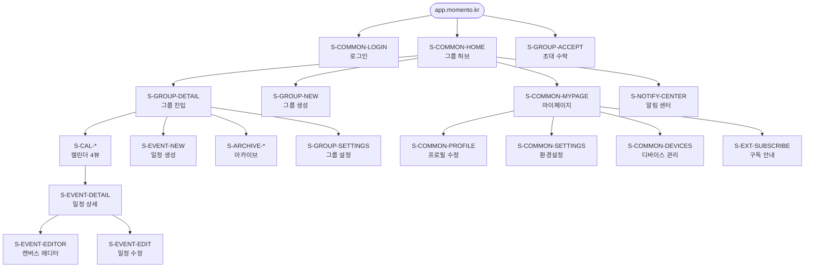
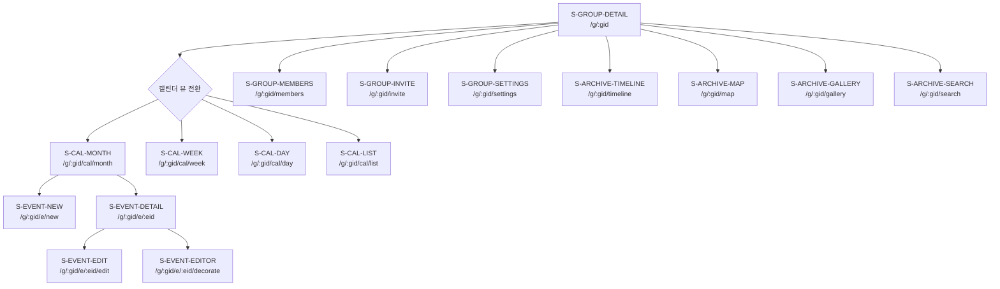
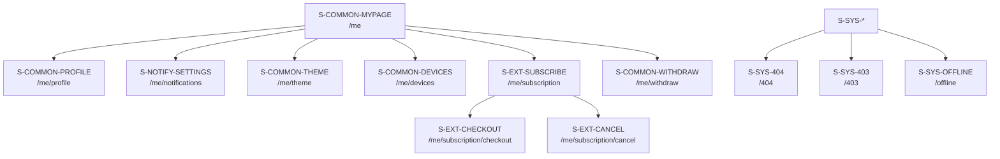
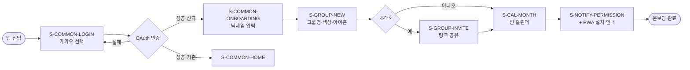
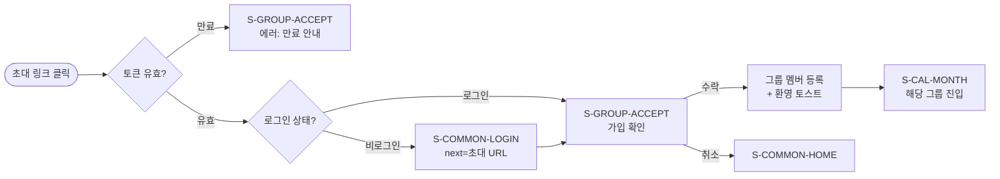
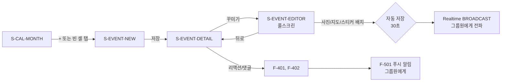
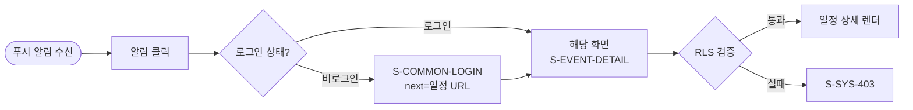
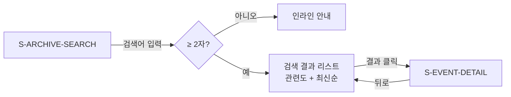
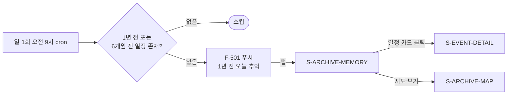
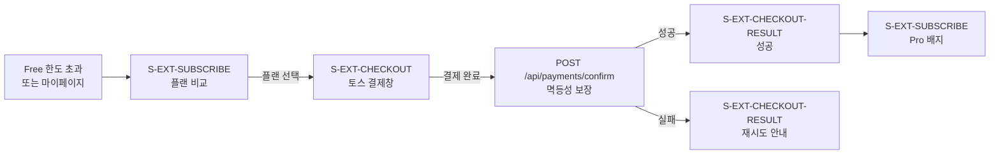

<!-- Claude Instruction:
이 문서는 기능명세서(#6)와 요구사항정의서(#5)를 기반으로 서비스 전체 정보 구조를 정의합니다.
화면 ID(S-XXX), URL 라우팅, 네비게이션, 사용자 흐름을 포함하여 #9 화면설계서의 입력 자료가 됩니다.
모든 화면은 PWA 모바일 퍼스트 + 데스크탑 반응형을 기준으로 설계합니다.
-->

# 정보구조도 (Information Architecture)

**프로젝트명**: 모먼토(Momento) — 온라인 다이어리 꾸미기 (Shared Diary Calendar)
**작성일**: 2026-05-31
**작성자**: 사내 신규 서비스 TF PM
**버전**: v1.0
**관련 산출물**: [기능명세서 v1.0](기능명세서.md), [요구사항정의서 v1.0](요구사항정의서.md), [서비스기획서 v1.0](서비스기획서.md), [PRD.md](../PRD.md)

---

## 1. 개요

### 1.1 설계 원칙

| 원칙 | 설명 | 근거 |
|------|------|------|
| **모바일 퍼스트** | 모든 화면은 320px ~ 1920px 반응형, 핵심 동선은 모바일 한 손 조작 기준 | REQ-061, NFR-030 |
| **그룹 컨텍스트 중심** | URL `/g/[group_id]/*` 패턴으로 그룹 컨텍스트를 라우팅에 직접 반영, 그룹 전환 1초 이내 | REQ-016, NFR-001 |
| **얕은 계층 (≤ 3 depth)** | 핵심 동선(캘린더 → 일정 → 에디터)은 3 depth 이내, Z세대 학습 시간 5분 이내 | NFR-034 |
| **얼웨이즈 캘린더** | 그룹 진입 시 즉시 캘린더 월 뷰가 기본 랜딩 (서비스 핵심 가치) | 서비스기획서 §4.1 |
| **딥링크 일관성** | 푸시 알림 → 일정 카드 1탭 이동, 비로그인은 로그인 후 자동 복귀 | REQ-053 |
| **폐쇄형 라우팅** | 그룹·일정·미디어 URL은 RLS 검증 후 렌더, 비인가 접근은 403 페이지 | NFR-021, NFR-024 |

### 1.2 화면 ID 체계

| 영역 | ID 접두사 | 설명 |
|------|-----------|------|
| 공통/계정 | `S-COMMON-` | 로그인, 마이페이지, 설정 등 비-그룹 화면 |
| 그룹 | `S-GROUP-` | 그룹 생성·관리·초대 |
| 캘린더 | `S-CAL-` | 월/주/일/리스트 뷰 |
| 일정 | `S-EVENT-` | 일정 상세·생성·수정·에디터 |
| 아카이브 | `S-ARCHIVE-` | 활동 피드, 추억 지도, 갤러리, 검색 |
| 알림 | `S-NOTIFY-` | 알림 센터·설정 |
| 확장(P1/P2) | `S-EXT-` | 스티커 마켓, 결제 |
| 시스템 | `S-SYS-` | 404, 403, 오프라인 |

### 1.3 화면 우선순위 (정합)

기능명세서 우선순위와 동일하게 P0(MVP)/P1(런칭 안정화)/P2(확장)로 분류합니다.

---

## 2. 전체 사이트맵

### 2.1 최상위 계층



### 2.2 그룹 컨텍스트 내부 구조



### 2.3 마이페이지 / 시스템 영역



---

## 3. 화면 카탈로그

### 3.1 공통 / 계정 영역

| 화면 ID | 화면명 | URL | 우선순위 | 접근 권한 | 주요 기능 | 관련 REQ |
|---------|--------|-----|----------|----------|-----------|----------|
| S-COMMON-LOGIN | 로그인 | `/login` | P0 | 게스트 | F-001 소셜 로그인 (Kakao/Google/Apple) | REQ-001 |
| S-COMMON-ONBOARDING | 온보딩 (3-step) | `/onboarding` | P0 | 신규 가입자 | 닉네임 입력 → 첫 그룹 생성/참여 → PWA 설치 안내 | REQ-002, REQ-010, REQ-060 |
| S-COMMON-HOME | 그룹 허브 (홈) | `/home` | P0 | 인증 | 그룹 카드 그리드, "+그룹 만들기", 최근 활동 미리보기 | REQ-016 |
| S-COMMON-MYPAGE | 마이페이지 | `/me` | P0 | 인증 | 메뉴 허브 (프로필/설정/디바이스/구독/탈퇴/로그아웃) | REQ-002~005 |
| S-COMMON-PROFILE | 프로필 수정 | `/me/profile` | P0 | 인증 | F-004 닉네임·프로필 사진·자기소개 편집 | REQ-002 |
| S-COMMON-SETTINGS | 환경설정 | `/me/settings` | P0 | 인증 | 언어·테마·PWA 재설치 안내 | REQ-062, REQ-060 |
| S-COMMON-THEME | 테마 설정 | `/me/theme` | P0 | 인증 | F-702 라이트/다크/시스템 자동 토글 | REQ-062 |
| S-COMMON-DEVICES | 디바이스 관리 | `/me/devices` | P0 | 인증 | F-002 다중 디바이스 세션 조회·원격 로그아웃 (최대 5대) | REQ-004 |
| S-COMMON-WITHDRAW | 회원 탈퇴 | `/me/withdraw` | P0 | 인증 | F-005 OAuth 재인증 → 익명화 → 영구 삭제 | REQ-003 |

### 3.2 그룹 관리 영역

| 화면 ID | 화면명 | URL | 우선순위 | 접근 권한 | 주요 기능 | 관련 REQ |
|---------|--------|-----|----------|----------|-----------|----------|
| S-GROUP-NEW | 그룹 생성 | `/g/new` | P0 | 인증 | F-101 그룹명·테마 컬러(8종)·아이콘·유형 입력 | REQ-010, REQ-013 |
| S-GROUP-DETAIL | 그룹 진입 (캘린더 랜딩) | `/g/:gid` | P0 | 그룹 멤버 | 진입 시 S-CAL-MONTH로 즉시 리다이렉트 | REQ-016, NFR-001 |
| S-GROUP-MEMBERS | 멤버 관리 | `/g/:gid/members` | P0 | 그룹 멤버 (수정은 owner/admin) | F-104 목록, F-105 권한 변경, F-106 강퇴 | REQ-014, REQ-015 |
| S-GROUP-INVITE | 초대 링크 발급 | `/g/:gid/invite` | P0 | owner/admin | F-102 일회성 링크 + 6자리 코드 + 공유 시트 | REQ-011, NFR-023 |
| S-GROUP-ACCEPT | 초대 수락 | `/invite/:token` 또는 `/join?code=XXXXXX` | P0 | 게스트/인증 | F-103 토큰 검증 → 가입 (비로그인은 로그인 후 자동 복귀) | REQ-012 |
| S-GROUP-SETTINGS | 그룹 설정 | `/g/:gid/settings` | P0 | owner | 그룹명/색상/아이콘 수정, 그룹 해체(P1) | REQ-010 |
| S-GROUP-LEAVE | 그룹 탈퇴 확인 | `/g/:gid/leave` (모달) | P0 | 그룹 멤버 | F-107 탈퇴 확인, owner는 권한 이양 흐름 분기 | REQ-014, REQ-015 |
| S-GROUP-DELETE | 그룹 해체 확인 | `/g/:gid/delete` (모달) | P1 | owner | F-108 30일 유예 안내 + "해체합니다" 직접 입력 | (서비스기획서 §4.2) |

### 3.3 캘린더 영역

| 화면 ID | 화면명 | URL | 우선순위 | 접근 권한 | 주요 기능 | 관련 REQ |
|---------|--------|-----|----------|----------|-----------|----------|
| S-CAL-MONTH | 월 뷰 (기본 랜딩) | `/g/:gid/cal/month?d=YYYY-MM` | P0 | 그룹 멤버 | F-205 6주 그리드, 멤버별 색상, 멤버 필터 토글 | REQ-023~025 |
| S-CAL-WEEK | 주 뷰 | `/g/:gid/cal/week?d=YYYY-MM-DD` | P0 | 그룹 멤버 | F-206 7일×24시간 타임라인 | REQ-023 |
| S-CAL-DAY | 일 뷰 | `/g/:gid/cal/day?d=YYYY-MM-DD` | P0 | 그룹 멤버 | F-206 24시간 + 일정 카드 누적 | REQ-023 |
| S-CAL-LIST | 리스트 뷰 | `/g/:gid/cal/list` | P0 | 그룹 멤버 | F-206 다가오는 일정 정렬 + D-day 핀 (REQ-026) | REQ-023, REQ-026 |

### 3.4 일정 / 에디터 영역

| 화면 ID | 화면명 | URL | 우선순위 | 접근 권한 | 주요 기능 | 관련 REQ |
|---------|--------|-----|----------|----------|-----------|----------|
| S-EVENT-NEW | 일정 생성 | `/g/:gid/e/new?d=YYYY-MM-DD` | P0 | 그룹 멤버 | F-201 제목/시작-종료/종일/위치/반복(P1) 입력 | REQ-020, REQ-021, REQ-027 |
| S-EVENT-DETAIL | 일정 상세 | `/g/:gid/e/:eid` | P0 | 그룹 멤버 (비공개 일정은 작성자만) | F-202 상세 + F-401 리액션 + F-402 댓글 | REQ-022, REQ-040~044 |
| S-EVENT-EDIT | 일정 수정 | `/g/:gid/e/:eid/edit` | P0 | 작성자 / owner / admin | F-203 일정 메타 수정 (캔버스는 S-EVENT-EDITOR) | REQ-022 |
| S-EVENT-EDITOR | 캔버스 에디터 (풀스크린) | `/g/:gid/e/:eid/decorate` | P0 | 그룹 멤버 | F-301~F-310 사진·지도·영상·텍스트·스티커·Undo/Redo | REQ-030~038 |
| S-EVENT-DELETE | 일정 삭제 확인 | (모달) | P0 | 작성자 / owner / admin | F-204 7일 휴지통 안내 | REQ-022 |
| S-EVENT-TRASH | 휴지통 | `/g/:gid/trash` | P1 | owner/admin | 7일 이내 삭제 일정 복구 | REQ-022 |

### 3.5 아카이브 영역

| 화면 ID | 화면명 | URL | 우선순위 | 접근 권한 | 주요 기능 | 관련 REQ |
|---------|--------|-----|----------|----------|-----------|----------|
| S-ARCHIVE-TIMELINE | 활동 피드 | `/g/:gid/timeline` | P1 | 그룹 멤버 | F-405 일정/댓글/리액션 시간순 피드 카드 | (서비스기획서 §4.2) |
| S-ARCHIVE-MAP | 추억 지도 ("다녀온 곳") | `/g/:gid/map` | P0 | 그룹 멤버 | 그룹 누적 지도 핀 + 클릭 시 일정 카드 이동 | REQ-072 |
| S-ARCHIVE-MEMORY | 이달의 추억 / 1년 전 오늘 | `/g/:gid/memory?d=YYYY-MM-DD` | P0 | 그룹 멤버 | F-406 자동 큐레이션 회고 카드 | REQ-070 |
| S-ARCHIVE-GALLERY | 그룹 갤러리 | `/g/:gid/gallery` | P1 | 그룹 멤버 | F-606 그룹 사진 그리드, 날짜/장소 필터 | (서비스기획서 §4.2) |
| S-ARCHIVE-SEARCH | 검색 | `/g/:gid/search?q=...` | P1 | 그룹 멤버 | F-208 제목·메모·장소·태그·작성자 검색 | REQ-071, NFR-005 |
| S-ARCHIVE-EXPORT | 데이터 내보내기 | `/g/:gid/export` | P2 | owner | ZIP/PDF 다운로드 (Free 월 1회·100건, Pro 무제한) | REQ-073, NFR-072 |

### 3.6 알림 영역

| 화면 ID | 화면명 | URL | 우선순위 | 접근 권한 | 주요 기능 | 관련 REQ |
|---------|--------|-----|----------|----------|-----------|----------|
| S-NOTIFY-CENTER | 알림 센터 (인박스) | `/notifications` | P1 | 인증 | F-504 최근 30일 알림 리스트, 읽음 처리, 일괄 읽음 | REQ-054 |
| S-NOTIFY-SETTINGS | 알림 설정 | `/me/notifications` | P0 | 인증 | F-505 그룹별·타입별 푸시/이메일 On/Off, F-506 방해 금지(P2), 빈도(즉시/요약/끄기) | REQ-005, REQ-052 |
| S-NOTIFY-PERMISSION | 푸시 권한 요청 (모달) | (오버레이) | P0 | 인증 | 첫 일정 등록 시 1회 노출, 거부 시 다음 방문 시 1회 재요청 | REQ-050 |

### 3.7 확장 영역 (P1 / P2)

| 화면 ID | 화면명 | URL | 우선순위 | 접근 권한 | 주요 기능 | 관련 REQ |
|---------|--------|-----|----------|----------|-----------|----------|
| S-EXT-MARKET | 스티커 마켓 | `/market` | P2 | 인증 | F-309 스티커 팩 검색·카테고리·구매 | REQ-080, REQ-081 |
| S-EXT-MARKET-DETAIL | 스티커 팩 상세 | `/market/:pack_id` | P2 | 인증 | 팩 미리보기 + 구매/다운로드 | REQ-081 |
| S-EXT-MARKET-STUDIO | 스티커 등록 (디자이너용) | `/market/studio` | P2 | 인증 | 팩 업로드 + 심사 워크플로우 진입 | REQ-080 |
| S-EXT-SUBSCRIBE | 구독 안내 | `/me/subscription` | P1 | 인증 | Free/Pro/Family 비교 + 결제 진입 | (서비스기획서 §6.2) |
| S-EXT-CHECKOUT | 결제 (토스페이먼츠) | `/me/subscription/checkout` | P2 | 인증 | F-705 PG 결제창 → confirm | REQ-083 |
| S-EXT-CHECKOUT-RESULT | 결제 결과 | `/me/subscription/result?orderId=...` | P2 | 인증 | 성공/실패 분기 화면 | REQ-083 |
| S-EXT-CANCEL | 구독 해지 | `/me/subscription/cancel` | P2 | 인증 | 해지 사유 → 다음 주기 종료 안내 | REQ-084 |
| S-EXT-EXTERNAL-CAL | 외부 캘린더 연동 | `/me/external-calendar` | P2 | Pro 이상 | F-210 Google OAuth / Apple ICS URL | REQ-082 |

### 3.8 시스템 / 보조 영역

| 화면 ID | 화면명 | URL | 우선순위 | 접근 권한 | 주요 기능 | 관련 REQ |
|---------|--------|-----|----------|----------|-----------|----------|
| S-SYS-404 | 페이지 없음 | `/404` | P0 | 공통 | 홈으로 돌아가기 CTA | — |
| S-SYS-403 | 접근 거부 | `/403` | P0 | 공통 | 그룹 미가입/비공개 콘텐츠 안내 | NFR-021 |
| S-SYS-OFFLINE | 오프라인 | `/offline` (Service Worker fallback) | P0 | 공통 | F-703 캐시 일정만 표시, 재연결 안내 | (PWA) |
| S-SYS-MAINTENANCE | 점검 안내 | `/maintenance` | P1 | 공통 | 가동률 99.5% 운영 시 사용 | NFR-010 |

---

## 4. URL 라우팅 규칙

### 4.1 라우팅 컨벤션

| 패턴 | 의미 | 예시 |
|------|------|------|
| `/`, `/home` | 인증 후 그룹 허브 | `/home` |
| `/login`, `/onboarding` | 게스트/온보딩 진입점 | `/login?next=/g/abc` |
| `/me/*` | 사용자 개인 영역 | `/me/profile` |
| `/g/:gid` | 그룹 컨텍스트 진입 (자동 → `/g/:gid/cal/month`) | `/g/grp_123` |
| `/g/:gid/cal/:view` | 캘린더 뷰 (view ∈ {month, week, day, list}) | `/g/grp_123/cal/month?d=2026-05` |
| `/g/:gid/e/:eid` | 일정 상세 | `/g/grp_123/e/evt_xyz` |
| `/g/:gid/e/:eid/decorate` | 캔버스 에디터 (풀스크린) | `/g/grp_123/e/evt_xyz/decorate` |
| `/invite/:token` | 일회성 초대 링크 | `/invite/abc123token` |
| `/join?code=XXXXXX` | 6자리 코드 가입 | `/join?code=A1B2C3` |
| `/market/*` | 스티커 마켓 (P2) | `/market/pack_001` |

### 4.2 식별자 규칙

| 식별자 | 형식 | 예시 |
|--------|------|------|
| `gid` (그룹 ID) | `grp_` + UUID7 (시간순 정렬 가능) | `grp_01HXY...` |
| `eid` (일정 ID) | `evt_` + UUID7 | `evt_01HXZ...` |
| `mid` (미디어 ID) | `med_` + UUID7 | `med_01HY0...` |
| 초대 토큰 | 256bit base64url (43자) | `aBcDef...` |
| 초대 코드 | 6자리 영숫자 (대문자, 0/O/1/I 제외) | `A1B2C3` |

### 4.3 보호된 라우트 (Middleware)

| 라우트 패턴 | 검증 | 실패 시 |
|-------------|------|---------|
| `/g/*`, `/me/*`, `/notifications` | 인증 토큰 유효성 | `/login?next=원래경로`로 리다이렉트 |
| `/g/:gid/*` | RLS — 본인이 해당 그룹 멤버인가 | `/403` |
| `/g/:gid/e/:eid/edit`, `/g/:gid/e/:eid?action=delete` | 작성자 또는 owner/admin | 인라인 에러 + 버튼 비활성 |
| `/g/:gid/invite`, `/g/:gid/members?action=*` | owner / admin | `/403` |
| `/g/:gid/settings`, `/g/:gid/delete` | owner 단독 | `/403` |
| `/me/external-calendar`, `/me/subscription/checkout` | Pro 이상 구독 활성 | `/me/subscription` 업그레이드 안내 |

### 4.4 쿼리 파라미터 표준

| 파라미터 | 용도 | 적용 화면 |
|----------|------|-----------|
| `d=YYYY-MM-DD` | 캘린더 기준 날짜 | S-CAL-* |
| `filter=member_id1,member_id2` | 멤버 필터 (URL 보존으로 공유 가능 — REQ-024) | S-CAL-* |
| `q=검색어` | 검색 키워드 | S-ARCHIVE-SEARCH |
| `next=원래경로` | 로그인 후 자동 복귀 | S-COMMON-LOGIN |
| `tab=details|comments|reactions` | 일정 상세 탭 | S-EVENT-DETAIL |
| `code=XXXXXX` | 코드 기반 그룹 가입 | S-GROUP-ACCEPT |

---

## 5. 네비게이션 구조

### 5.1 모바일 네비게이션 (320px ~ 767px, 핵심 동선)

```
┌─────────────────────────┐
│   Top App Bar           │  ← 그룹명 + 검색/알림 아이콘
├─────────────────────────┤
│                         │
│   Main Content          │  ← 화면별 콘텐츠
│                         │
├─────────────────────────┤
│  [캘린더][피드][+][갤러리][마이]│  ← Bottom Tab (5 + FAB)
└─────────────────────────┘
```

| 위치 | 항목 | 동작 | 표시 조건 |
|------|------|------|-----------|
| Top Left | 그룹 스위처 (그룹 이름 + ▼) | 탭 시 그룹 목록 드로어 (S-COMMON-HOME 인라인) | 그룹 컨텍스트 진입 시 |
| Top Right | 검색 (돋보기) | S-ARCHIVE-SEARCH 이동 | 그룹 컨텍스트 |
| Top Right | 알림 (종) + 배지 | S-NOTIFY-CENTER 이동 | 항상 |
| Bottom Tab 1 | 캘린더 | S-CAL-MONTH | 그룹 컨텍스트 |
| Bottom Tab 2 | 피드 | S-ARCHIVE-TIMELINE | 그룹 컨텍스트 |
| Bottom Tab 3 (FAB) | + (일정 생성) | S-EVENT-NEW (오늘 날짜) | 그룹 컨텍스트 |
| Bottom Tab 4 | 갤러리 | S-ARCHIVE-GALLERY | 그룹 컨텍스트 |
| Bottom Tab 5 | 마이 | S-COMMON-MYPAGE | 항상 |
| FAB 우하단 | 빠른 일정 추가 (대안) | S-EVENT-NEW 모달 | 캘린더 진입 시 |

### 5.2 데스크탑 네비게이션 (≥ 1024px)

```
┌──────┬──────────────────────────────────────────┐
│      │   Top Bar (그룹명 · 뷰 전환 · 검색 · 알림 · 프로필)│
│ 좌측  ├──────────────────────────────────────────┤
│ 사이드 │                                          │
│ 바    │            Main Content                  │
│ 그룹   │           (캘린더 / 일정 상세)             │
│ 스위처 │                                          │
│      │                                          │
└──────┴──────────────────────────────────────────┘
```

| 위치 | 항목 | 동작 |
|------|------|------|
| 좌측 사이드바 | 그룹 카드 리스트 (현재 그룹 강조) + "+ 새 그룹" | 클릭 시 그룹 전환 (REQ-016) |
| 좌측 사이드바 하단 | 마이 / 설정 / 알림 / 로그아웃 | 각 화면 진입 |
| Top Bar 중앙 | 월/주/일/리스트 탭 전환 | S-CAL-* 라우팅 |
| Top Bar 우측 | 검색·알림·프로필 아바타 드롭다운 | 각 화면 진입 |
| 캘린더 우측 패널 (옵션) | 멤버 필터·다가오는 일정 위젯 | F-207 |

### 5.3 상단 컨텍스트 헤더 (모든 그룹 화면)

| 영역 | 내용 |
|------|------|
| 좌측 | ← 뒤로 (서브 화면), 그룹명 (캘린더 화면) |
| 중앙 | 현재 화면 타이틀 또는 캘린더 월 표시 (예: "2026년 5월") |
| 우측 | 화면별 액션 (필터·공유·메뉴) |

---

## 6. 주요 사용자 흐름 (User Flow)

### 6.1 신규 가입 → 첫 그룹 생성 (UC-01)



### 6.2 초대 링크로 가입 (UC-02)



### 6.3 일정 생성 + 꾸미기 (UC-03)



### 6.4 푸시 알림 → 딥링크 진입 (REQ-053)



### 6.5 검색 → 일정 진입 (REQ-071)



### 6.6 추억 회고 (UC-04, P0 + P2)



### 6.7 결제 (Pro 구독, P2)



---

## 7. 접근 권한 매트릭스

### 7.1 역할 정의

| 역할 | 정의 | 부여 방식 |
|------|------|-----------|
| guest | 비로그인 사용자 | 기본 |
| user | 로그인 사용자 | 소셜 로그인 후 |
| member | 그룹 멤버 | 초대 수락 시 |
| admin | 그룹 관리자 | owner가 승격 |
| owner | 그룹장 | 그룹 생성자 (이양 가능) |
| pro | Pro 구독자 | 결제 완료 |
| superadmin | 운영자 | 백오피스 별도 부여 (P2) |

### 7.2 화면별 접근 권한

| 화면 | guest | user | member | admin | owner | pro |
|------|-------|------|--------|-------|-------|-----|
| S-COMMON-LOGIN | O | O | O | O | O | O |
| S-COMMON-HOME, MYPAGE | X | O | O | O | O | O |
| S-GROUP-NEW | X | O | O | O | O | O |
| S-GROUP-DETAIL, S-CAL-*, S-EVENT-DETAIL | X | X | O | O | O | O |
| S-EVENT-NEW, EDIT (본인), EDITOR | X | X | O (본인 일정만 EDIT) | O | O | O |
| S-GROUP-INVITE, S-GROUP-MEMBERS(수정) | X | X | X | O | O | O |
| S-GROUP-SETTINGS, S-GROUP-DELETE | X | X | X | X | O | O |
| S-EXT-EXTERNAL-CAL | X | X | — | — | — | O |
| S-EXT-MARKET-STUDIO | X | O | O | O | O | O (심사 워크플로우) |

### 7.3 그룹 외 사용자 차단 (NFR-021 정합)

- 모든 `/g/:gid/*`, `/g/:gid/e/:eid/*`, `/g/:gid/api/*` 요청은 Supabase RLS로 검증
- 비인가 접근 시 클라이언트는 `S-SYS-403`, API는 `403 Forbidden` 응답
- 미디어 URL은 Supabase Storage 서명 URL(만료 1시간)로 발급, RLS 통과 후에만 발급

---

## 8. 콘텐츠 모델 매핑

### 8.1 화면 ↔ 핵심 데이터 객체

| 화면 | 주요 객체 | API 엔드포인트 (예상, #7에서 확정) |
|------|-----------|-----------------------------------|
| S-CAL-MONTH | `events[]` (월±1주 fetch) | `GET /api/groups/:gid/events?range=...` |
| S-EVENT-DETAIL | `event` + `decorations` + `comments[]` + `reactions[]` + `media[]` | `GET /api/events/:eid?include=...` |
| S-EVENT-EDITOR | `event_decorations.canvas_state` (JSONB) | `PATCH /api/events/:eid/decorations` |
| S-GROUP-MEMBERS | `group_members[]` JOIN `profiles[]` | `GET /api/groups/:gid/members` |
| S-ARCHIVE-MAP | `events[]` WHERE `decorations.type='map_pin'` | `GET /api/groups/:gid/map-pins` |
| S-NOTIFY-CENTER | `notifications[]` (최근 30일) | `GET /api/notifications?limit=50` |

### 8.2 글로벌 상태 (Client State)

| 상태 | 저장 위치 | 휘발성 |
|------|-----------|--------|
| 인증 토큰 | localStorage | 30일 (Refresh Token) |
| 현재 그룹 ID | URL + Zustand store | URL 우선 |
| 테마 모드 | localStorage (`theme: 'light'|'dark'|'system'`) | 영구 |
| 멤버 필터 | URL 쿼리 (`?filter=`) | 화면별 |
| 오프라인 큐 | IndexedDB | 재연결 시까지 |
| 캘린더 데이터 | React Query 캐시 | TTL 5분 + Realtime 무효화 |

---

## 9. 후속 산출물 매핑

| 후속 산출물 | 본 문서에서 활용할 섹션 |
|-------------|------------------------|
| #7 API스펙 | §4 URL 라우팅 + §8 콘텐츠 모델 → REST 엔드포인트 도출 |
| #9 화면설계서 | §3 화면 카탈로그 → 모든 화면의 와이어프레임 1:1 매핑 |
| #11 시스템정의서 | §5 네비게이션 + §7 권한 → 컴포넌트 모듈 구조 |
| #12 데이터베이스설계서 | §8 콘텐츠 모델 → 테이블/RLS 정책 |
| #15 테스트시나리오 | §6 사용자 흐름 → E2E 시나리오 |

---

## 10. 변경 이력

| 버전 | 날짜 | 작성자 | 변경 내용 |
|------|------|--------|-----------|
| v1.0 | 2026-05-31 | 사내 신규 서비스 TF PM | 초안 작성. 기능명세서 57개 기능 → 화면 50여 개 매핑, URL 라우팅·네비게이션·7개 핵심 흐름 정의 |

---

**승인**:
- [ ] 정보구조도 승인 (User Sign-off)
- [ ] NotebookLM 소스 등록 (자동)
- [ ] #9 화면설계서 작성 시 본 문서 §3 화면 카탈로그를 1:1 입력 자료로 사용
