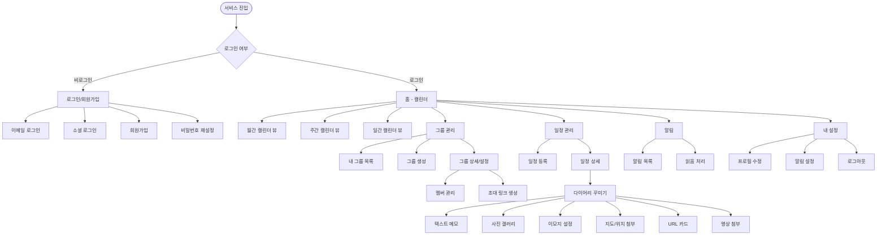
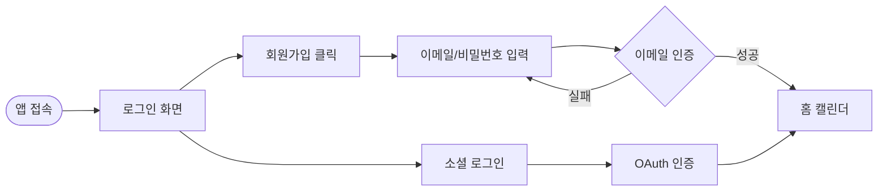
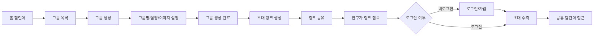
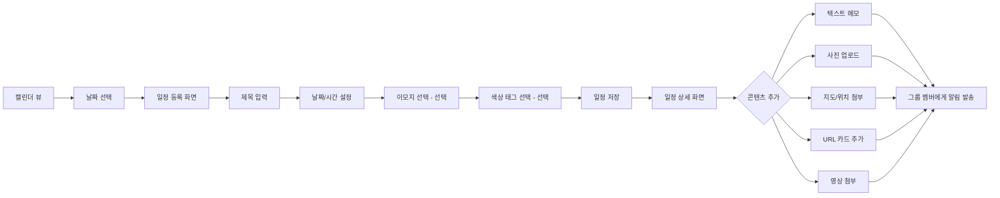
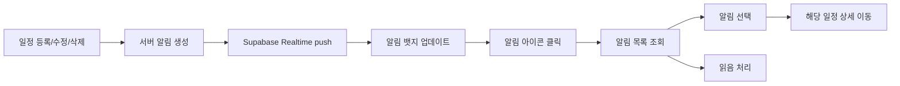

# 정보구조도 (Information Architecture)

**프로젝트명**: 온라인 다이어리 꾸미기 (Share Diary Calendar)
**작성일**: 2026-05-24

---

## 1. 전체 사이트맵

---

## 2. 사용자 흐름 (User Flow)

### 2.1 신규 사용자 가입 흐름

---

### 2.2 그룹 생성 및 초대 흐름

---

### 2.3 일정 등록 및 다이어리 꾸미기 흐름

---

### 2.4 알림 수신 및 확인 흐름

---

## 3. 화면-기능 매핑

| 화면명 | URL | 주요 기능 | 관련 기능 ID |
|--------|-----|-----------|-------------|
| 로그인 | /login | 이메일/소셜 로그인 | F-001 |
| 회원가입 | /signup | 이메일 회원가입 | F-001 |
| 홈 캘린더 | / | 공유 캘린더 조회 (월간) | F-003 |
| 그룹 목록 | /groups | 내 그룹 목록 | F-002 |
| 그룹 생성 | /groups/new | 그룹 생성 | F-002 |
| 그룹 설정 | /groups/:id/settings | 멤버 관리, 초대 링크 | F-002 |
| 초대 수락 | /invite/:token | 초대 링크 수락 | F-002 |
| 일정 등록 | /schedules/new | 일정 생성 | F-004, F-007 |
| 일정 상세 | /schedules/:id | 일정 조회 + 다이어리 꾸미기 | F-004~F-010 |
| 알림 | /notifications | 알림 목록, 읽음 처리 | F-011 |
| 설정 | /settings | 프로필, 알림 설정 | F-001 |

---

## 4. 접근 권한 매트릭스

| 화면 | 비로그인 | 로그인 (그룹 비멤버) | 그룹 멤버 | 그룹 오너 |
|------|----------|---------------------|----------|----------|
| 로그인/회원가입 | O | O | O | O |
| 홈 캘린더 | X | X | O | O |
| 그룹 생성 | X | O | O | O |
| 그룹 캘린더 | X | X | O | O |
| 일정 등록 | X | X | O | O |
| 일정 수정/삭제 | X | X | 본인 일정만 | 전체 |
| 멤버 강퇴 | X | X | X | O |
| 초대 링크 생성 | X | X | X | O |
