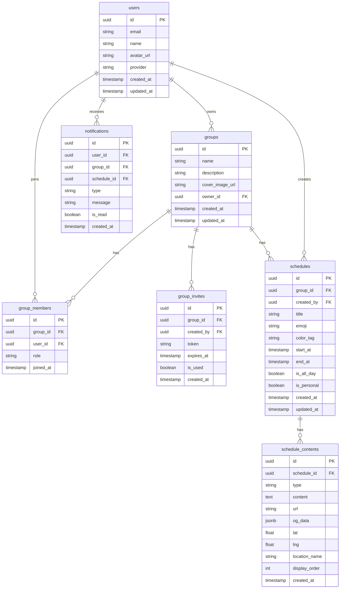

# 데이터베이스 설계서

**프로젝트명**: 온라인 다이어리 꾸미기 (Share Diary Calendar)
**작성일**: 2026-05-24
**DB**: PostgreSQL (Supabase 호스팅)

---

## 1. ERD (Entity-Relationship Diagram)

---

## 2. 테이블 정의

### users (사용자)

| 컬럼명 | 타입 | 제약조건 | 기본값 | 설명 |
|--------|------|----------|--------|------|
| id | UUID | PK | gen_random_uuid() | 사용자 고유 ID |
| email | VARCHAR(255) | UNIQUE, NOT NULL | - | 이메일 |
| name | VARCHAR(50) | NOT NULL | - | 닉네임 |
| password_hash | VARCHAR(255) | NULL | NULL | 비밀번호 해시 (이메일 가입만) |
| avatar_url | TEXT | NULL | NULL | 프로필 이미지 URL |
| provider | VARCHAR(20) | NOT NULL | 'email' | 'email' / 'google' / 'kakao' |
| created_at | TIMESTAMPTZ | NOT NULL | NOW() | 생성일시 |
| updated_at | TIMESTAMPTZ | NOT NULL | NOW() | 수정일시 |

---

### groups (그룹)

| 컬럼명 | 타입 | 제약조건 | 기본값 | 설명 |
|--------|------|----------|--------|------|
| id | UUID | PK | gen_random_uuid() | 그룹 고유 ID |
| name | VARCHAR(30) | NOT NULL | - | 그룹명 |
| description | VARCHAR(100) | NULL | NULL | 그룹 설명 |
| cover_image_url | TEXT | NULL | NULL | 커버 이미지 URL |
| owner_id | UUID | FK(users.id), NOT NULL | - | 오너 사용자 ID |
| created_at | TIMESTAMPTZ | NOT NULL | NOW() | 생성일시 |
| updated_at | TIMESTAMPTZ | NOT NULL | NOW() | 수정일시 |

---

### group_members (그룹 멤버)

| 컬럼명 | 타입 | 제약조건 | 기본값 | 설명 |
|--------|------|----------|--------|------|
| id | UUID | PK | gen_random_uuid() | 멤버십 고유 ID |
| group_id | UUID | FK(groups.id), NOT NULL | - | 그룹 ID |
| user_id | UUID | FK(users.id), NOT NULL | - | 사용자 ID |
| role | VARCHAR(10) | NOT NULL | 'member' | 'owner' / 'member' |
| joined_at | TIMESTAMPTZ | NOT NULL | NOW() | 가입일시 |
| UNIQUE | (group_id, user_id) | - | - | 중복 가입 방지 |

---

### group_invites (초대 링크)

| 컬럼명 | 타입 | 제약조건 | 기본값 | 설명 |
|--------|------|----------|--------|------|
| id | UUID | PK | gen_random_uuid() | 초대 고유 ID |
| group_id | UUID | FK(groups.id), NOT NULL | - | 그룹 ID |
| created_by | UUID | FK(users.id), NOT NULL | - | 생성자 (오너) ID |
| token | VARCHAR(64) | UNIQUE, NOT NULL | - | 초대 토큰 |
| expires_at | TIMESTAMPTZ | NOT NULL | NOW()+72h | 만료일시 |
| is_used | BOOLEAN | NOT NULL | false | 사용 여부 |
| created_at | TIMESTAMPTZ | NOT NULL | NOW() | 생성일시 |

---

### schedules (일정)

| 컬럼명 | 타입 | 제약조건 | 기본값 | 설명 |
|--------|------|----------|--------|------|
| id | UUID | PK | gen_random_uuid() | 일정 고유 ID |
| group_id | UUID | FK(groups.id), NOT NULL | - | 그룹 ID |
| created_by | UUID | FK(users.id), NOT NULL | - | 등록자 ID |
| title | VARCHAR(50) | NOT NULL | - | 일정 제목 |
| emoji | VARCHAR(10) | NULL | NULL | 대표 이모지 |
| color_tag | VARCHAR(7) | NULL | '#4ECDC4' | 색상 HEX |
| start_at | TIMESTAMPTZ | NOT NULL | - | 시작 일시 |
| end_at | TIMESTAMPTZ | NULL | NULL | 종료 일시 |
| is_all_day | BOOLEAN | NOT NULL | false | 종일 여부 |
| is_personal | BOOLEAN | NOT NULL | false | 개인 일정 여부 |
| created_at | TIMESTAMPTZ | NOT NULL | NOW() | 생성일시 |
| updated_at | TIMESTAMPTZ | NOT NULL | NOW() | 수정일시 |

---

### schedule_contents (일정 콘텐츠)

| 컬럼명 | 타입 | 제약조건 | 기본값 | 설명 |
|--------|------|----------|--------|------|
| id | UUID | PK | gen_random_uuid() | 콘텐츠 고유 ID |
| schedule_id | UUID | FK(schedules.id), NOT NULL | - | 일정 ID |
| type | VARCHAR(20) | NOT NULL | - | 'text' / 'image' / 'video' / 'url' / 'location' |
| content | TEXT | NULL | NULL | 텍스트 내용 (type=text) |
| url | TEXT | NULL | NULL | 파일 URL (type=image/video) 또는 외부 URL (type=url) |
| og_data | JSONB | NULL | NULL | OG 태그 데이터 (type=url): {title, description, image, domain} |
| lat | DECIMAL(10,7) | NULL | NULL | 위도 (type=location) |
| lng | DECIMAL(10,7) | NULL | NULL | 경도 (type=location) |
| location_name | VARCHAR(100) | NULL | NULL | 장소명 (type=location) |
| display_order | INT | NOT NULL | 0 | 표시 순서 |
| created_at | TIMESTAMPTZ | NOT NULL | NOW() | 생성일시 |

---

### notifications (알림)

| 컬럼명 | 타입 | 제약조건 | 기본값 | 설명 |
|--------|------|----------|--------|------|
| id | UUID | PK | gen_random_uuid() | 알림 고유 ID |
| user_id | UUID | FK(users.id), NOT NULL | - | 수신자 사용자 ID |
| group_id | UUID | FK(groups.id), NOT NULL | - | 관련 그룹 ID |
| schedule_id | UUID | FK(schedules.id), NULL | NULL | 관련 일정 ID |
| type | VARCHAR(30) | NOT NULL | - | 'SCHEDULE_CREATED' / 'SCHEDULE_UPDATED' / 'SCHEDULE_DELETED' / 'MEMBER_JOINED' |
| message | VARCHAR(200) | NOT NULL | - | 알림 메시지 |
| is_read | BOOLEAN | NOT NULL | false | 읽음 여부 |
| created_at | TIMESTAMPTZ | NOT NULL | NOW() | 생성일시 |

---

## 3. 인덱스 정의

| 테이블 | 인덱스명 | 컬럼 | 유형 | 목적 |
|--------|----------|------|------|------|
| users | idx_users_email | email | UNIQUE | 로그인 조회 |
| group_members | idx_group_members_group_user | (group_id, user_id) | UNIQUE | 중복 가입 방지 |
| group_members | idx_group_members_user_id | user_id | INDEX | 내 그룹 목록 조회 |
| group_invites | idx_group_invites_token | token | UNIQUE | 초대 링크 조회 |
| schedules | idx_schedules_group_id | group_id | INDEX | 그룹별 일정 조회 |
| schedules | idx_schedules_start_at | start_at | INDEX | 기간별 일정 조회 |
| schedule_contents | idx_contents_schedule_id | schedule_id | INDEX | 일정별 콘텐츠 조회 |
| notifications | idx_notif_user_id | user_id | INDEX | 사용자별 알림 조회 |
| notifications | idx_notif_user_unread | (user_id, is_read) | INDEX | 미읽음 알림 조회 |

---

## 4. 관계 정의

| 부모 테이블 | 자식 테이블 | 관계 | FK 컬럼 | ON DELETE |
|-------------|-------------|------|---------|-----------|
| users | groups | 1:N | owner_id | RESTRICT |
| users | group_members | 1:N | user_id | CASCADE |
| groups | group_members | 1:N | group_id | CASCADE |
| groups | group_invites | 1:N | group_id | CASCADE |
| groups | schedules | 1:N | group_id | CASCADE |
| users | schedules | 1:N | created_by | RESTRICT |
| schedules | schedule_contents | 1:N | schedule_id | CASCADE |
| users | notifications | 1:N | user_id | CASCADE |
| groups | notifications | 1:N | group_id | CASCADE |
| schedules | notifications | 1:N | schedule_id | SET NULL |

---

## 5. 초기 데이터 (Seed)

| 테이블 | 데이터 | 용도 |
|--------|--------|------|
| users | 테스트 계정 3개 | 개발 테스트 |
| groups | 테스트 그룹 2개 | 개발 테스트 |
| group_members | 위 계정의 멤버십 | 개발 테스트 |
| schedules | 샘플 일정 5개 | UI 확인용 |

---

## 6. Supabase 설정

### Row Level Security (RLS) 정책

| 테이블 | 정책 | 설명 |
|--------|------|------|
| groups | SELECT: 그룹 멤버만 | group_members에 자신의 user_id가 있는 그룹만 조회 |
| schedules | ALL: 그룹 멤버만 | 해당 그룹의 멤버만 CRUD |
| schedule_contents | ALL: 그룹 멤버만 | 해당 일정 그룹의 멤버만 CRUD |
| notifications | SELECT/UPDATE: 본인만 | user_id = auth.uid() |

### Storage Bucket 설정

| 버킷명 | 용도 | 공개 여부 | 용량 제한 |
|--------|------|-----------|-----------|
| schedule-images | 일정 사진 | Private (서명 URL) | 10MB/파일 |
| schedule-videos | 일정 영상 | Private (서명 URL) | 100MB/파일 |
| group-covers | 그룹 커버 이미지 | Public | 5MB/파일 |
| avatars | 사용자 프로필 | Public | 2MB/파일 |
