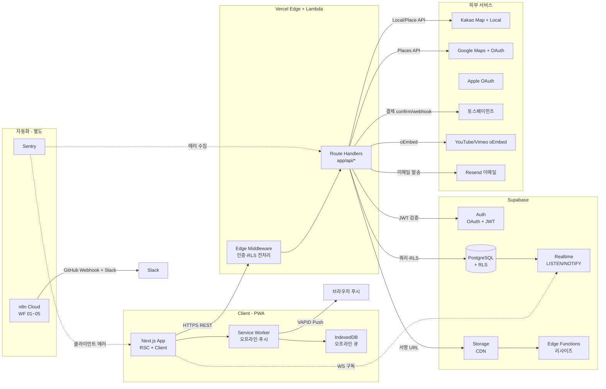
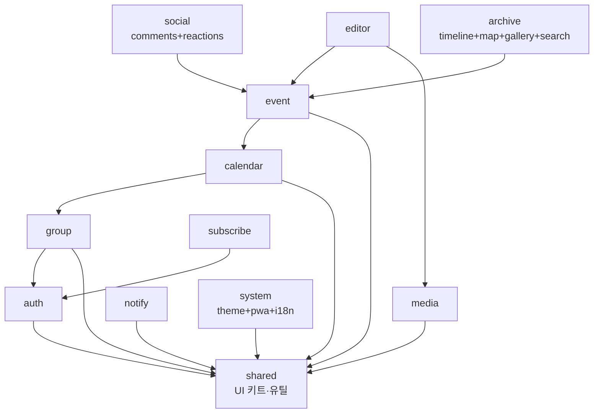

<!-- Claude Instruction:
이 문서는 기능명세서(#6) + 정보구조도(#8) + API스펙(#7) + 서비스기획서(#4)를 기반으로
시스템의 기술 스택, 모듈 구성, 디렉토리 구조, 코딩 컨벤션, 에러 처리 규약을 정의합니다.
M1~M4 단계 기준 (CLAUDE.md Backend 배치 전략 정합).
-->

# 시스템 정의서 (System Definition)

**프로젝트명**: 모먼토(Momento) — 온라인 다이어리 꾸미기
**작성일**: 2026-05-31
**버전**: v1.0
**관련 산출물**: [기능명세서](../02.기획문서/기능명세서.md), [정보구조도](../02.기획문서/정보구조도.md), [API스펙](../02.기획문서/API스펙.md), [서비스기획서](../02.기획문서/서비스기획서.md), [PRD.md](../PRD.md)
**Backend 배치 단계**: **M1~M4 (Next.js API Routes 통합)** — `src/backend/`는 .gitkeep 유지

---

## 1. 기술 스택

V0.42 표준 + 모먼토 특화 라이브러리.

### 1.1 핵심 스택

| 영역 | 기술 | 버전 | 선정 사유 |
|------|------|------|-----------|
| Frontend | **Next.js (App Router)** | 14.x | SSR/SSG, PWA 친화, M1~M4 API Routes 통합 |
| 스타일 | **Tailwind CSS** | 3.x | 다꾸 UI 빠른 시제품화, 다크모드 클래스 토글 |
| 언어 | **TypeScript** | 5.x (strict) | NFR-060 타입 안정성 |
| Backend (M1~M4) | **Next.js Route Handlers** | 14.x | Vercel 통합 배포, 콜드스타트 빠름 |
| Database | **PostgreSQL** | 15 (Supabase 호스팅) | 관계형 + RLS + LISTEN/NOTIFY |
| 인증 | **Supabase Auth** | 최신 | Kakao/Google/Apple OAuth, JWT |
| 스토리지 | **Supabase Storage** | 최신 | CDN 자동화 + RLS |
| 실시간 | **Supabase Realtime** | 최신 | Postgres LISTEN 기반 (REQ-021, NFR-002) |
| 배포 | **Vercel** | - | GitHub 자동 배포, Edge CDN |
| CI/CD | **GitHub Actions** | - | lint/type/test/build/deploy |
| 알림 자동화 | **n8n Cloud** | - | WF 01~05 (PM Agent 포함) |
| 모니터링 | **Sentry Free** | 최신 | NFR-063 |

### 1.2 도메인 특화 라이브러리

| 영역 | 라이브러리 | 용도 |
|------|-----------|------|
| 캔버스 에디터 | **Konva.js** (1순위) / Fabric.js (대안) | F-301~F-310 모바일 터치 + 다중 드래그앤드롭 (NLM PDF p.13 Risk 1 대응) |
| 캘린더 렌더 | **react-big-calendar** (커스텀) 또는 자체 구현 | F-205~F-207 4뷰 |
| 반복 규칙 | **rrule.js** | F-209 RFC 5545 |
| 지도 | **react-kakao-maps-sdk** + Google Maps JS API | F-303 듀얼 지원 |
| 영상 oEmbed | **react-player** (YouTube/Vimeo) | F-304 |
| 이미지 압축 | **browser-image-compression** | F-602 WebP 변환 |
| EXIF | **exifr** | F-605 |
| 한글 형태소 | PostgreSQL **pg_jieba** 또는 **mecab-ko** | F-208 검색 |
| 폼 | **react-hook-form** + zod | 인라인 검증 (NFR-033) |
| 서버 상태 | **@tanstack/react-query** | 캘린더 캐시 + Realtime 무효화 |
| 클라이언트 상태 | **zustand** | 그룹 컨텍스트, 테마 |
| PWA | **next-pwa** + **workbox** | F-701, F-703 |
| 결제 | **@tosspayments/payment-sdk** | F-705 (P2) |
| i18n | **next-i18next** | F-704 (P1) |
| 인증 비교 | **bcryptjs** (서버리스 호환) | NFR-022 |
| HTML→이미지 | **html2canvas** | F-604 캔버스 합본 다운로드 |
| 알림 (서버) | **web-push** | F-501 VAPID |

### 1.3 한 줄 표기

`Next.js 14 (App Router) + TypeScript + Tailwind CSS / Next.js Route Handlers / Supabase (PostgreSQL + Auth + Storage + Realtime) / Vercel`

---

## 2. 시스템 아키텍처

### 2.1 컴포넌트 다이어그램



### 2.2 배포 토폴로지 (M1~M4)

| 구성 | 위치 | 비고 |
|------|------|------|
| Vercel Root Directory | `src/frontend/` | 단일 프로젝트 배포 |
| API 코드 | `src/frontend/app/api/*` | Route Handlers |
| 정적 자산 | Vercel CDN (Edge) | 자동 |
| DB | Supabase (서울 또는 도쿄 리전) | NFR-001 응답 1초 이내 |
| 이미지 CDN | Supabase Storage CDN | 글로벌 캐싱 |
| `src/backend/` | **비활성 (.gitkeep)** | M5 분리 시 Express로 활성화 |

M5+ 트리거 (NFR-051): Lambda 60초 한도 초과 작업 발생, 함수 호출 수 초과, 장기 실행 큐/크론 필요 → `src/backend/` 활성화 + Render/Railway 분리.

---

## 3. 모듈 구성

기능명세서 8개 모듈을 코드 영역으로 그대로 매핑합니다. 모듈 간 의존은 단방향이며 순환 의존을 금지합니다.

### 3.1 클라이언트 모듈 의존성



### 3.2 모듈 카탈로그

| 모듈 | 디렉토리 | 책임 | 의존 |
|------|---------|------|------|
| `shared` | `src/frontend/lib/shared` | UI 키트(Button/Modal/Toast), 날짜·포맷·검증 유틸 | — |
| `auth` | `src/frontend/lib/auth` + `app/(auth)` | 소셜 로그인, 세션, 디바이스 관리 (F-001~F-005) | shared |
| `group` | `src/frontend/lib/group` + `app/(app)/g/[gid]` | 그룹 CRUD, 멤버, 초대 (F-101~F-108) | auth |
| `calendar` | `src/frontend/lib/calendar` + `app/(app)/g/[gid]/cal` | 4뷰, 필터, 색상 (F-205~F-209) | group |
| `event` | `src/frontend/lib/event` + `app/(app)/g/[gid]/e` | 일정 CRUD, 휴지통 (F-201~F-204) | calendar |
| `editor` | `src/frontend/lib/editor` (Konva.js 래퍼) | 캔버스, 데코, 자동 저장 (F-301~F-310) | event, media |
| `social` | `src/frontend/lib/social` | 댓글, 6종 리액션, 멘션 (F-401~F-405) | event |
| `media` | `src/frontend/lib/media` | 업로드/리사이즈/EXIF (F-601~F-605) | shared |
| `notify` | `src/frontend/lib/notify` + `app/(app)/notifications` | 푸시 구독, 알림 센터, 설정 (F-501~F-506) | shared |
| `archive` | `src/frontend/lib/archive` + `app/(app)/g/[gid]/{timeline,map,gallery,search}` | 회고·지도·갤러리·검색 (F-208, F-405, F-406, F-606) | event |
| `subscribe` | `src/frontend/lib/subscribe` + `app/(app)/me/subscription` | Pro 구독, 토스 결제 (F-705) | auth |
| `system` | `src/frontend/lib/system` | 테마, PWA, i18n (F-701~F-704) | shared |

### 3.3 서버(API) 모듈

`src/frontend/app/api/*` 하위에 모듈별 라우트 폴더. 공통 미들웨어는 `src/frontend/lib/server/`에 배치.

| 폴더 | 책임 |
|------|------|
| `app/api/auth/*` | OAuth 콜백, 세션, 디바이스 |
| `app/api/me/*` | 프로필, 알림 설정, 구독 |
| `app/api/groups/*` | 그룹·멤버·초대 |
| `app/api/events/*` | 일정·데코·코멘트·리액션 (nested 일부) |
| `app/api/media/*` | 서명 URL, finalize |
| `app/api/notifications/*` | 푸시 구독, 알림 읽음 |
| `app/api/payments/*` | 토스 결제, 웹훅 |
| `app/api/decorations/*` | oEmbed, OG preview |
| `app/api/health` | 헬스체크 |
| `lib/server/auth.ts` | JWT 검증, `requireUser()` |
| `lib/server/rls.ts` | `requireGroupMember(gid, role?)` |
| `lib/server/error.ts` | 표준 에러 응답 유틸 |
| `lib/server/supabase.ts` | 서버용 Supabase 클라이언트 (Service Role) |
| `lib/server/realtime.ts` | BROADCAST 헬퍼 |

---

## 4. 디렉토리 구조

```
src/
├── frontend/                    # Vercel Root Directory (M1~M4)
│   ├── app/
│   │   ├── (auth)/              # 비로그인 라우트
│   │   │   ├── login/page.tsx
│   │   │   └── onboarding/page.tsx
│   │   ├── (app)/               # 인증 보호 라우트
│   │   │   ├── home/page.tsx
│   │   │   ├── me/
│   │   │   │   ├── page.tsx
│   │   │   │   ├── profile/page.tsx
│   │   │   │   ├── notifications/page.tsx
│   │   │   │   ├── devices/page.tsx
│   │   │   │   ├── subscription/page.tsx
│   │   │   │   └── withdraw/page.tsx
│   │   │   ├── g/
│   │   │   │   └── [gid]/
│   │   │   │       ├── page.tsx               # → cal/month 리다이렉트
│   │   │   │       ├── cal/[view]/page.tsx
│   │   │   │       ├── e/
│   │   │   │       │   ├── new/page.tsx
│   │   │   │       │   └── [eid]/
│   │   │   │       │       ├── page.tsx
│   │   │   │       │       ├── edit/page.tsx
│   │   │   │       │       └── decorate/page.tsx
│   │   │   │       ├── members/page.tsx
│   │   │   │       ├── invite/page.tsx
│   │   │   │       ├── settings/page.tsx
│   │   │   │       ├── timeline/page.tsx
│   │   │   │       ├── map/page.tsx
│   │   │   │       ├── gallery/page.tsx
│   │   │   │       └── search/page.tsx
│   │   │   └── notifications/page.tsx
│   │   ├── invite/[token]/page.tsx
│   │   ├── api/
│   │   │   ├── auth/...
│   │   │   ├── me/...
│   │   │   ├── groups/...
│   │   │   ├── events/...
│   │   │   ├── media/...
│   │   │   ├── notifications/...
│   │   │   ├── payments/...
│   │   │   ├── decorations/...
│   │   │   └── health/route.ts
│   │   ├── layout.tsx
│   │   ├── globals.css
│   │   ├── manifest.json
│   │   └── sw.ts                # next-pwa 빌드 산출
│   ├── components/
│   │   ├── ui/                  # Button, Modal, Toast 등 (shadcn 스타일)
│   │   ├── calendar/
│   │   ├── editor/
│   │   ├── event/
│   │   ├── group/
│   │   └── shared/
│   ├── lib/
│   │   ├── shared/
│   │   ├── auth/
│   │   ├── group/
│   │   ├── calendar/
│   │   ├── event/
│   │   ├── editor/
│   │   ├── social/
│   │   ├── media/
│   │   ├── notify/
│   │   ├── archive/
│   │   ├── subscribe/
│   │   ├── system/
│   │   └── server/              # 서버 전용
│   │       ├── auth.ts
│   │       ├── rls.ts
│   │       ├── error.ts
│   │       ├── supabase.ts
│   │       └── realtime.ts
│   ├── public/
│   │   ├── icons/
│   │   ├── stickers/            # 기본 50종
│   │   └── manifest.json
│   ├── styles/
│   ├── middleware.ts            # 인증 + 라우트 보호 (정보구조도 §4.3)
│   ├── next.config.mjs
│   ├── tailwind.config.ts
│   ├── tsconfig.json
│   └── package.json
└── backend/                     # M5+ 분리 시 활성화 — 현재 .gitkeep만 유지
    └── .gitkeep
```

---

## 5. 인터페이스 규약

### 5.1 REST API 계약

[API스펙](../02.기획문서/API스펙.md)을 단일 출처로 합니다. 본 문서는 다음 메타 규약만 정의:

| 항목 | 규약 |
|------|------|
| 응답 형식 | `{ data | error, meta }` (API스펙 §1.4 정합) |
| 시간 표기 | ISO8601 + 타임존 (예: `2026-06-01T14:00:00+09:00`) |
| 식별자 | `<prefix>_<UUID7>` (정보구조도 §4.2) |
| Idempotency Key | 결제·미디어 finalize는 `Idempotency-Key` 헤더 권장 |
| 페이지네이션 | cursor 기반 (offset 금지) |

### 5.2 Realtime 채널 계약

[API스펙 §13](../02.기획문서/API스펙.md) 참조. 구독 권한은 DB RLS와 동일.

### 5.3 클라이언트 ↔ 서버 데이터 변환

- 서버: `snake_case` (DB 컬럼 정합)
- 클라이언트: `camelCase` (TS/JS 컨벤션)
- 변환 책임: `lib/shared/api/client.ts`의 fetch 래퍼가 자동 변환 (요청은 snake로, 응답은 camel로)

---

## 6. 보안 정책 (요구사항정의서 §2.4 정합)

| 항목 | 정책 | 구현 |
|------|------|------|
| 전송 암호화 | HTTPS 강제 + HSTS | Vercel 기본 |
| 인증 | JWT Bearer (1시간) + Refresh (30일) | Supabase Auth |
| 인가 (그룹) | RLS 정책 — 모든 테이블에 `group_id` 기반 정책 | Supabase RLS (NFR-021) |
| 인가 (역할) | API 미들웨어 `requireGroupMember(gid, role)` | `lib/server/rls.ts` |
| 비밀번호/시크릿 | 평문 저장 금지, bcryptjs 또는 Vault | NFR-022 |
| 초대 링크 | 256bit 토큰 + 1회 사용 OR 24시간 | NFR-023 |
| 미디어 접근 | 서명 URL 1시간 만료 | NFR-024 |
| 감사 로그 | 로그인·탈퇴·결제·삭제 1년 보관 | `audit_logs` 테이블 |
| XSS/CSRF/SQLi | OWASP Top 10 대응, ZAP 스캔 Critical 0 | CI 보안 스캔 (NFR-027) |
| Rate Limit | 인증 10/min, 업로드 20/min, 일반 300/min | Vercel KV 또는 Upstash |
| 청소년 | 14세 미만 가입 시 법정대리인 동의 흐름 | NFR-071 |

---

## 7. 코딩 컨벤션

| 항목 | 규칙 | 근거 |
|------|------|------|
| 언어 | TypeScript strict, `tsc --noEmit` 에러 0 | NFR-060 / CLAUDE.md |
| 파일명 | 컴포넌트는 PascalCase, 유틸은 kebab-case | 관행 |
| 변수/함수 | camelCase | TS 표준 |
| DB 컬럼 | snake_case | Postgres 관행 |
| 컴포넌트 | 함수형 + Hooks, RSC 우선 (Client Component는 명시) | App Router |
| 들여쓰기 | 스페이스 2 | Prettier 기본 |
| 린트 | ESLint (next/core-web-vitals, @typescript-eslint, eslint-config-prettier) | CI 단계 강제 |
| 포맷 | Prettier (printWidth 100, semi true, singleQuote true) | CI 단계 강제 |
| Import 정렬 | eslint-plugin-import (외부 → 내부 → 상대) | 가독성 |
| 한국어 식별자 | 금지 (UI 텍스트는 i18n) | NFR-032 |
| 주석 | WHY만 작성, WHAT은 코드로 | CLAUDE.md |
| 커밋 메시지 | `[Wn] 산출물명 - 작업 내용` (한국어) | CLAUDE.md Git Conventions |
| 브랜치 | `feature/기능명`, `fix/버그명` | CLAUDE.md |
| 환경변수 | UPPER_SNAKE_CASE, `.env.local` 사용 (Vercel 대시보드 등록) | 표준 |

### 7.1 환경변수 목록

| 변수 | 용도 | 비고 |
|------|------|------|
| `NEXT_PUBLIC_SUPABASE_URL` | 클라이언트용 | |
| `NEXT_PUBLIC_SUPABASE_ANON_KEY` | 클라이언트용 | |
| `SUPABASE_SERVICE_ROLE_KEY` | 서버 전용 (RLS 우회 작업) | Vercel만 |
| `NEXT_PUBLIC_KAKAO_MAP_APP_KEY` | 카카오 지도 | |
| `NEXT_PUBLIC_GOOGLE_MAPS_API_KEY` | 구글 지도 | |
| `KAKAO_LOCAL_REST_API_KEY` | 서버 reverse geocoding | |
| `JWT_SECRET` | 보조 토큰 서명 | |
| `RESEND_API_KEY` | 이메일 (F-502) | |
| `VAPID_PUBLIC_KEY` / `VAPID_PRIVATE_KEY` | 웹 푸시 | |
| `TOSS_SECRET_KEY` / `NEXT_PUBLIC_TOSS_CLIENT_KEY` | 결제 (P2) | |
| `SENTRY_DSN` | 에러 모니터링 | |
| `NEXT_PUBLIC_SITE_URL` | OG 미리보기·결제 returnUrl | |

---

## 8. 에러 처리 규약

API스펙 §1.5 표를 따릅니다. 클라이언트 표준 처리:

| 시나리오 | UX |
|----------|-----|
| 401 | Refresh 시도 → 실패 시 로그인 화면 + 토스트 |
| 403 (그룹) | `/403` 페이지 |
| 404 | "삭제된 일정입니다" 토스트 + 이전 화면 |
| 409 (캔버스 충돌) | 최신 상태 fetch + 사용자에게 "최신 변경 반영, 다시 시도" |
| 410 (초대 만료) | "초대 링크가 만료되었습니다" 모달 |
| 413 | "10MB 이하 이미지만 가능합니다" 토스트 |
| 422 (한도) | Pro 업그레이드 모달 |
| 429 | "잠시 후 다시 시도해주세요" + 지수 백오프 |
| 500/503 | "일시적 오류입니다" + Sentry 자동 보고 |
| 네트워크 단절 | F-703 오프라인 모드 진입 |

---

## 9. 로깅·모니터링

| 항목 | 도구 | 정책 |
|------|------|------|
| 클라이언트 에러 | Sentry Free + `/api/diagnostics/error` 폴백 | 최근 30일, 5분 이내 알림 |
| 서버 에러 | Sentry + Vercel Logs | 동일 |
| 구조화 로그 | `console.log(JSON.stringify({ level, msg, ... }))` | Vercel Drain |
| 성능 (RUM) | Vercel Analytics + WebVitals | LCP/INP 대시보드 |
| Uptime | UptimeRobot | NFR-010 99.5% 모니터 |
| DB | Supabase Dashboard (Slow Query Log) | 1초 초과 자동 알림 |

---

## 10. 개발·배포 워크플로우

### 10.1 로컬 개발

```
git clone ...
cd src/frontend
cp .env.example .env.local      # 키 입력
npm install
npm run dev                      # localhost:3000
```

### 10.2 GitHub Actions CI (NFR-062)

`.github/workflows/ci.yml`:

1. `npm ci`
2. `npm run lint`
3. `npm run typecheck` (`tsc --noEmit`)
4. `npm run test` (Jest + Vitest, 커버리지 80%)
5. `npm run build`
6. axe 접근성 + Lighthouse PWA 90 검증
7. Vercel 자동 배포 (main → Production, PR → Preview)

### 10.3 브랜치 전략

| 브랜치 | 용도 |
|--------|------|
| `main` | 프로덕션 |
| `develop` | 통합 (선택) |
| `feature/*` | 기능 개발 |
| `fix/*` | 버그 수정 |
| `chore/*` | 유지보수 |

PR → Review 1인 이상 → Squash Merge.

---

## 11. 변경 이력

| 버전 | 날짜 | 변경 |
|------|------|------|
| v1.0 | 2026-05-31 | 초안. 12개 모듈·디렉토리·컨벤션·환경변수·CI 정의 |
