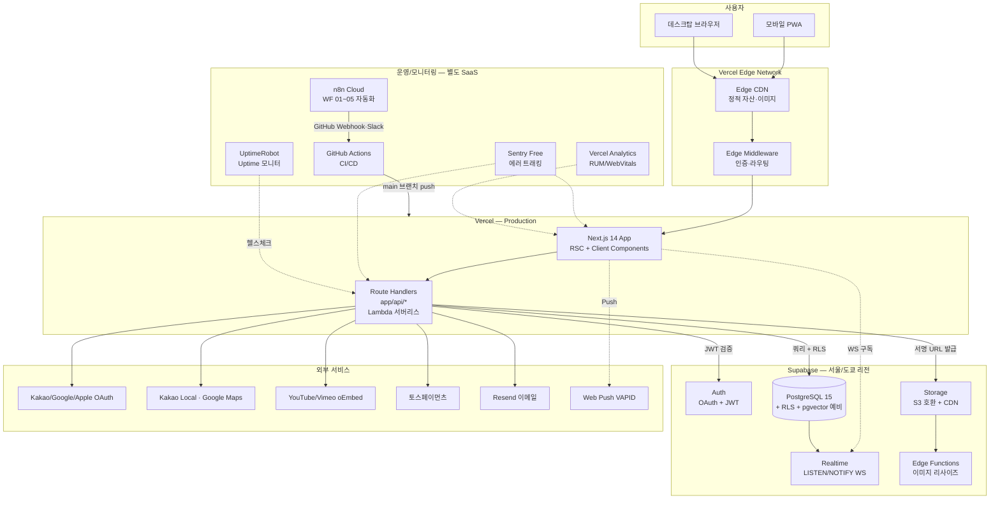
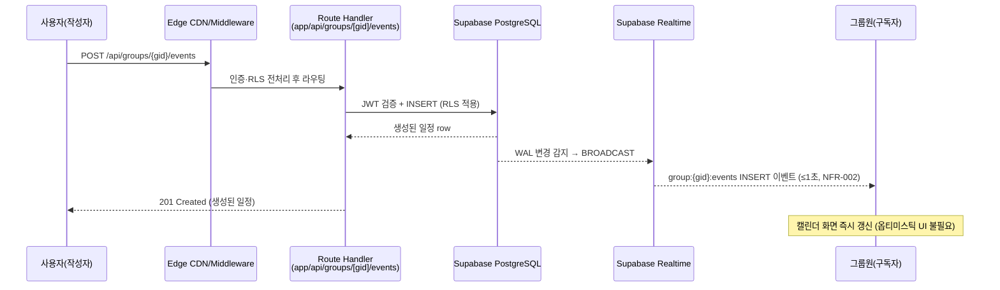
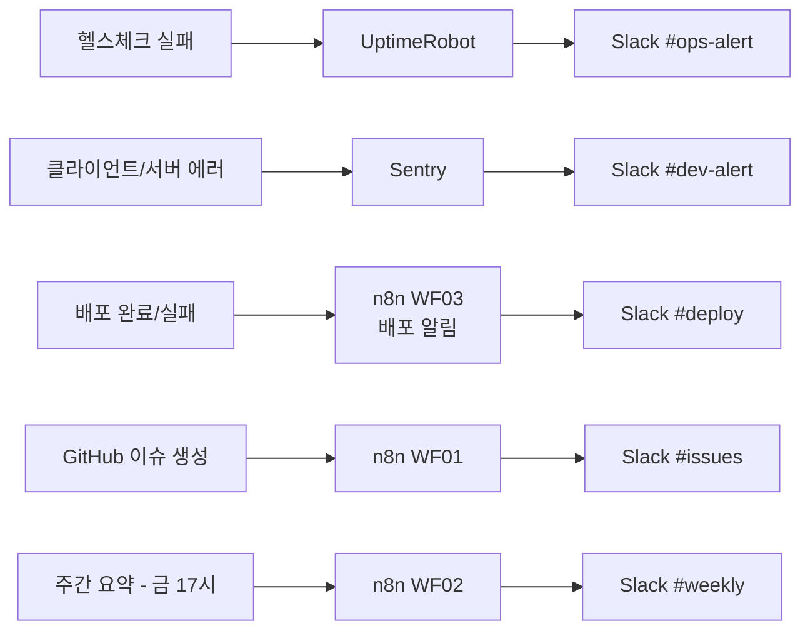
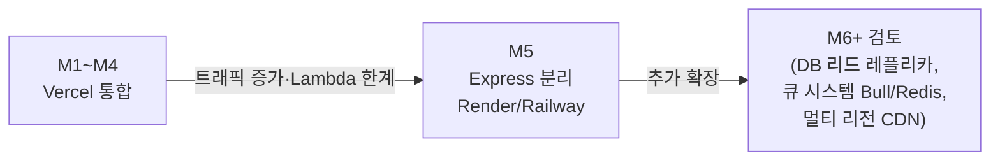

<!-- Claude Instruction:
이 문서는 화면설계서(#9) + 시스템정의서(#11)를 기반으로 인프라 구성, 배포 토폴로지,
모니터링/백업/장애 대응, 비용·확장 계획을 정의합니다.
CLAUDE.md "Backend 배치 전략(M1~M4 통합 / M5+ 분리)"을 본 산출물에 반드시 명시합니다.
-->

# 인프라 아키텍처 (Infrastructure Architecture)

**프로젝트명**: 모먼토(Momento) — 온라인 다이어리 꾸미기
**작성일**: 2026-06-07
**작성자**: 사내 신규 서비스 TF PM
**버전**: v1.0
**관련 산출물**: [화면설계서 v1.0](../02.기획문서/화면설계서.md), [시스템정의서 v1.0](시스템정의서.md), [API스펙 v1.0](../02.기획문서/API스펙.md), [PRD.md](../PRD.md)
**Gate-Check**: 통과 — #9 상태=완료 (.progress.md 확인)
**현재 단계**: **M1 ~ M4 — API Routes 통합 (Vercel Frontend + API 단일 배포)**

---

## 1. 개요

### 1.1 문서 목적

화면설계서(#9)에서 정의한 약 50개 화면과 시스템정의서(#11)의 컴포넌트 구성을 실제 운영 가능한 인프라로 매핑합니다. 1인/소규모 운영을 전제로 한 V0.42 표준 스택(Next.js + Tailwind / Supabase / Vercel) 기반 배포 토폴로지, 모니터링·백업·장애 대응, 비용·확장 계획을 정의합니다.

### 1.2 현재 단계 명시 — M1~M4 통합

| 항목 | 내용 |
|------|------|
| **현재 단계** | **M1~M4 (API Routes 통합)** — CLAUDE.md "Backend 배치 전략" 정합 |
| API 위치 | `src/frontend/app/api/*` (Next.js App Router Route Handlers) |
| 백엔드 배포 | Vercel 단일 배포 (Frontend + API 통합) |
| `src/backend/` | **빈 폴더 (`.gitkeep`)** — 미사용, M5 분리 시 활성화 |
| 분리 검토 시점 | M5+ — 트래픽 증가, Lambda 60초 한도 초과 작업, 장기 실행 큐/크론 필요 시 (§9 참조) |

> 본 산출물은 시스템정의서 §2.2 "배포 토폴로지(M1~M4)"의 운영 디테일을 인프라 관점에서 구체화한 것입니다.

---

## 2. 인프라 구성도

### 2.1 전체 인프라 토폴로지

### 2.2 요청 흐름 (대표 시나리오 — 일정 생성 + Realtime 동기화)

---

## 3. 환경별 구성

### 3.1 환경 매트릭스

| 환경 | 트리거 | Vercel 배포 | Supabase 프로젝트 | 도메인 |
|------|--------|-------------|-------------------|--------|
| 로컬 개발 | `npm run dev` | — | Dev 프로젝트 (또는 로컬 `supabase start`) | `localhost:3000` |
| Preview (스테이징) | PR 생성/갱신 | Vercel Preview (자동) | Staging 프로젝트 | `*.vercel.app` (PR별 고유 URL) |
| Production | `main` 브랜치 머지 | Vercel Production | Production 프로젝트 | `momento.kr` (커스텀 도메인) |

### 3.2 Vercel 프로젝트 설정

| 항목 | 값 |
|------|-----|
| Root Directory | `src/frontend/` |
| Framework Preset | Next.js |
| Build Command | `npm run build` |
| Install Command | `npm ci` |
| Node 버전 | 20.x |
| 이미지 최적화 | `images.unoptimized = true` (정적 export 충돌 방지, NLM 트러블슈팅 패턴 정합) |
| Functions Region | `icn1` (서울) — Supabase 리전과 근접 배치로 레이턴시 최소화 |

### 3.3 환경변수 (Vercel Dashboard 등록 — 시스템정의서 §7.1 정합)

| 분류 | 변수 | 환경 |
|------|------|------|
| Supabase | `NEXT_PUBLIC_SUPABASE_URL`, `NEXT_PUBLIC_SUPABASE_ANON_KEY`, `SUPABASE_SERVICE_ROLE_KEY` | 전체 (Service Role은 Production/Preview만, 로컬 제외 권장) |
| 지도 | `NEXT_PUBLIC_KAKAO_MAP_APP_KEY`, `NEXT_PUBLIC_GOOGLE_MAPS_API_KEY`, `KAKAO_LOCAL_REST_API_KEY` | 전체 |
| 인증/보조 | `JWT_SECRET` | 전체 |
| 이메일 | `RESEND_API_KEY` | 전체 |
| 푸시 | `VAPID_PUBLIC_KEY`, `VAPID_PRIVATE_KEY` | 전체 |
| 결제 (P2) | `TOSS_SECRET_KEY`, `NEXT_PUBLIC_TOSS_CLIENT_KEY` | Production은 라이브 키, Preview/로컬은 테스트 키 |
| 모니터링 | `SENTRY_DSN` | 전체 |
| 사이트 | `NEXT_PUBLIC_SITE_URL` | 환경별 도메인 값 분리 |

> 키 관리는 `.AP-key.md`에서 추적하며(.gitignore 등록), 라이브/테스트 키 전환은 환경변수 교체만으로 수행 (CLAUDE.md 결제 체크리스트 정합).

---

## 4. 네트워크·도메인·보안

### 4.1 도메인 / DNS / TLS

| 항목 | 구성 |
|------|------|
| 도메인 | `momento.kr` (Production), `staging.momento.kr` (선택, Preview 별칭) |
| DNS | Vercel Nameserver 또는 외부 등록기관 + CNAME 연결 |
| TLS | Vercel 자동 발급/갱신 (Let's Encrypt), HTTPS 강제 + HSTS |
| Edge CDN | Vercel Edge Network — 정적 자산·이미지 글로벌 캐싱 |

### 4.2 네트워크 경계 및 접근 제어

| 구간 | 보호 수단 |
|------|-----------|
| 클라이언트 ↔ Vercel | HTTPS, Edge Middleware에서 1차 인증 검증 |
| Vercel ↔ Supabase | HTTPS REST/RPC (PostgREST), Service Role 키는 Lambda 환경변수에서만 접근 (NFR-022) |
| Supabase 내부 | RLS 정책으로 행 단위 접근 제어 (시스템정의서 §6 정합) |
| 외부 API (지도/결제/이메일) | 서버 사이드(Route Handlers)에서만 시크릿 키 사용, 클라이언트는 공개 키만 노출 |
| Rate Limiting | Vercel KV 또는 Upstash Redis — 인증 10/min, 업로드 20/min, 일반 300/min, 검색 60/min (API스펙 §1.6) |

### 4.3 IPv6/IPv4 이슈 대응 (NLM 트러블슈팅 패턴)

| 이슈 | 원인 | 대응 |
|------|------|------|
| Supabase DB 직접 연결 실패 | Supabase는 IPv6 전용, Vercel Lambda는 IPv4 | PostgREST REST API의 RPC 함수(`run_query`/`run_mutation`)로 SQL 실행, 직접 PG 드라이버 연결 회피 |
| 서명 업로드 URL | Lambda 60초 제한 우회 | 클라이언트가 Supabase Storage에 직접 업로드 (API스펙 §7.1 `upload-url` 패턴) |

---

## 5. 데이터 저장·백업·복구

### 5.1 PostgreSQL (Supabase)

| 항목 | 정책 |
|------|------|
| 리전 | 서울(ap-northeast-2) 우선, 미지원 시 도쿄 — NFR-001(응답 1초 이내) 정합 |
| 백업 주기 | 일 1회 자동 백업 (Supabase 관리형, PRD.md 비기능 요건 정합) + Point-in-Time Recovery (Pro 플랜 시) |
| 보존 기간 | 최소 7일 (Supabase Free), Pro 플랜 시 확장 |
| RLS | 전 테이블 적용 (데이터베이스설계서 §5 정합) |
| 마이그레이션 | Supabase CLI 기반 버전 관리 (`supabase/migrations/`) |

### 5.2 Storage (미디어)

| 항목 | 정책 |
|------|------|
| 버킷 구조 | 그룹별 폴더 격리 (`{group_id}/{media_id}.{ext}`), RLS로 그룹 외 접근 차단 |
| CDN | Supabase Storage CDN (글로벌 캐싱), 원본/preview(800px)/thumbnail(200px) 3종 |
| 용량 한도 | Free 플랜 그룹당 1GB / Pro 50GB (서비스기획서 §6.2 정합) |
| 휴지통 정책 | 일정/미디어 Soft Delete 7일 → cron 영구 삭제, 회원 탈퇴 미디어 30일 유예 |
| 백업 | Supabase Storage 자체 이중화(가용성) — 별도 외부 백업은 M5+ 트래픽 증가 시 검토 |

### 5.3 복구 시나리오

| 장애 유형 | 대응 |
|-----------|------|
| DB 손상/오작동 | Supabase PITR 복구 또는 일 1회 백업 스냅샷 복원 |
| 잘못된 배포 (코드) | Vercel "Instant Rollback"으로 직전 Production 배포로 즉시 전환 |
| 미디어 유실 | Storage 자체 이중화 + 애플리케이션 `media` 테이블 메타로 정합성 점검 |
| 전체 장애 | 상태 페이지(UptimeRobot 공개 페이지) 안내 + 디버그 엔드포인트로 raw 데이터 확인 (CLAUDE.md 디버깅 원칙) |

---

## 6. 모니터링·로깅·알림 체계

### 6.1 모니터링 스택

| 영역 | 도구 | 측정 항목 | 임계치/정책 |
|------|------|-----------|-------------|
| 가동률 | UptimeRobot | `GET /api/health` 폴링 (5분 주기) | 다운 시 5분 이내 알림 (NFR-010, 99.5%) |
| 에러 추적 | Sentry Free | 클라이언트·서버 예외, 스택트레이스 | 신규 이슈 5분 이내 Slack 알림 |
| 성능 (RUM) | Vercel Analytics + Web Vitals | LCP, INP, CLS | 회귀 발생 시 대시보드 확인 |
| DB 성능 | Supabase Dashboard (Slow Query Log) | 쿼리 응답시간 | 1초 초과 쿼리 자동 알림 |
| 구조화 로그 | `console.log(JSON.stringify({level,msg,...}))` → Vercel Log Drain | 요청/에러 로그 | 7~30일 보관 (Vercel 플랜별) |

### 6.2 알림 라우팅

> n8n 워크플로우 01~05는 CLAUDE.md "n8n 워크플로우 자산"에 정의된 자산을 그대로 사용 (Credential 연결만 수행).

### 6.3 헬스체크 엔드포인트

`GET /api/health` (API스펙 §12.1) — DB·Storage·외부 API(카카오맵) 연결 상태를 `{ db, storage, kakao_map }` 형태로 반환. UptimeRobot이 5분 주기로 폴링하며, 응답 지연/실패 시 알림.

---

## 7. CI/CD 파이프라인

### 7.1 GitHub Actions 워크플로우 (시스템정의서 §10.2 정합)

```mermaid
flowchart LR
    PR[PR 생성/푸시] --> Lint[npm run lint] --> Type[tsc --noEmit] --> Test[Jest/Vitest<br/>커버리지 80%] --> Build[npm run build] --> A11y[axe 접근성 +<br/>Lighthouse PWA ≥90]
    A11y --> Preview[Vercel Preview 배포]
    Preview --> Review[PR 리뷰 1인 이상]
    Review --> Merge[Squash Merge → main]
    Merge --> ProdDeploy[Vercel Production 배포]
    ProdDeploy --> Notify[n8n WF03 → Slack 배포 알림]
```

### 7.2 배포 단계별 체크리스트 (CLAUDE.md 트러블슈팅 가이드 §1 정합)

| 순서 | 항목 | 검증 방법 |
|------|------|-----------|
| 1 | 회원가입/로그인 | 특수문자(`!@#`) 포함 비밀번호로 실제 가입 시도 (Vercel Body Escaping 이슈 확인) |
| 2 | 정적 에셋 | 상품/스티커 이미지, 폰트 HTTP 200 확인 |
| 3 | UI 레이아웃 | 중복 요소(검색창, 네비게이션) 육안 확인 |
| 4 | API 응답 | 브라우저 개발자 도구 Network 탭 |
| 5 | 모바일 반응형 | 320px~ 뷰포트 레이아웃 확인 |
| 6 | 환경변수 | Vercel 대시보드에서 필수 변수 등록 여부 확인 |

### 7.3 알려진 플랫폼 이슈 대응 (CLAUDE.md 트러블슈팅 가이드 §2 정합)

| 이슈 | 대응 |
|------|------|
| Vercel Body Escaping (`!` 입력 시 JSON 파싱 에러) | 커스텀 바디 파서로 invalid escape 제거 |
| 네이티브 모듈(`bcrypt`) 에러 | `bcryptjs` (순수 JS) 사용 |
| Supabase IPv6 전용 | REST API RPC 함수로 SQL 실행 |
| Next.js 동적 라우트 vs `output: export` | export 설정 제거, `tsc --noEmit`만 CI에서 실행 |
| `useSearchParams` prerender 에러 | `<Suspense>` 래핑 필수 |

---

## 8. 비용 추정 (MVP~정식 런칭 기준)

### 8.1 월 비용 (M1~M4 통합 구조)

| 서비스 | 플랜 | 월 비용 (₩, 환산) | 비고 |
|--------|------|------|------|
| Vercel | Hobby (무료) → Pro 전환 검토 | ₩0 ~ ₩28,000 (Pro $20) | 트래픽 증가 시 Pro 전환 (Lambda 3GB/60초) |
| Supabase | Free → Pro 전환 검토 | ₩0 ~ ₩35,000 (Pro $25) | DB 용량·일일 백업 보존기간 확장 시 |
| 도메인 | `.kr` 등록 | 약 ₩20,000/년 | |
| Sentry | Free | ₩0 | 5,000 이벤트/월 한도 |
| UptimeRobot | Free | ₩0 | 50개 모니터까지 무료 |
| n8n Cloud | Starter | 약 ₩28,000~ | WF 01~05 운영 |
| Resend (이메일) | Free → 유료 전환 검토 | ₩0 ~ | 일 발송량 초과 시 |
| 토스페이먼츠 (P2) | 거래 수수료 | 거래액의 약 1.x~3.x% | 결제 활성화 이후 |
| **합계 (MVP)** | | **약 ₩0 ~ ₩50,000/월** | Free 플랜 조합으로 시작 가능 |
| **합계 (정식 런칭)** | | **약 ₩100,000~ ₩150,000/월** | Vercel Pro + Supabase Pro 전환 시 |

> 1인 운영 전제 — 통합 구조(M1~M4)는 별도 백엔드 호스팅 비용($7~/월 Render 등)이 발생하지 않아 비용·운영 부하 모두 최소화 (CLAUDE.md Backend 배치 전략 §비교표 정합).

### 8.2 트래픽 가정 (NFR 정합)

| 단계 | 동시 접속자 | 비고 |
|------|-------------|------|
| MVP (Phase 1) | 1,000명 | Vercel Hobby/Pro + Supabase Free/Pro로 충분 |
| 정식 런칭 (Phase 2) | 3,000~5,000명 | Vercel Pro + Supabase Pro 권장 |
| 확장 (Phase 3) | 10,000명 | M5 분리 적극 검토 (§9) |

---

## 9. 확장 계획 — M5+ 분리 검토

### 9.1 M5 분리 트리거 (시스템정의서 §2.2 정합)

다음 중 하나에 해당하면 M5 분리(Express 백엔드 + Render/Railway/Fly.io)를 적극 검토합니다.

| 트리거 | 설명 |
|--------|------|
| Lambda 60초 한도 초과 | PDF 워터마크, 대용량 영상 처리 등 정상 흐름에 장기 작업 포함 |
| 함수 호출 수 초과 | Vercel Pro 플랜 한도 근접/초과 |
| 장기 실행 큐/크론 | 알림 발송, 데이터 내보내기(REQ-073) 등이 빈번해져 서버리스로 부적합 |
| 외부 시스템 통합 비용 | 자체 호스팅이 운영상 더 유리한 경우 |

### 9.2 M5 분리 시 변경 사항

| 항목 | M1~M4 (현재) | M5+ (분리 후) |
|------|--------------|---------------|
| API 위치 | `src/frontend/app/api/*` | `src/backend/` (Express.js) |
| 백엔드 호스팅 | Vercel (통합) | Render / Railway / Fly.io ($7~/월) |
| 프론트 ↔ 백엔드 연결 | 동일 프로젝트 내부 호출 | `pages/api/[...path].ts` 프록시 → Express |
| CORS | 불필요 | Vercel 도메인 화이트리스트 필요 |
| 비용 | Vercel만 | Vercel + 별도 호스팅 추가 |
| 마이그레이션 용이성 | — | API Routes 코드를 Express 라우터로 이전 (시스템정의서 §3.3 폴더 구조가 1:1 대응되도록 사전 설계됨) |

### 9.3 확장 시 인프라 변경 로드맵

---

## 10. 산출물 간 매핑

### 10.1 본 문서가 입력 자료로 제공하는 후속 산출물

| 후속 산출물 | 활용 섹션 |
|-------------|-----------|
| #16 테스트결과보고서 | §7.2 배포 후 검수 체크리스트 → 라이브 검증 항목 |
| #17 완료보고서 | §8 비용 추정, §9 확장 계획 → 운영 인수인계 자료 |

### 10.2 본 문서가 참조한 선행 산출물

| 선행 산출물 | 활용 내용 |
|-------------|-----------|
| 화면설계서 v1.0 | 약 50개 화면 구성 → 트래픽·정적 자산 규모 추정 근거 |
| 시스템정의서 v1.0 | §1 기술 스택, §2 컴포넌트 다이어그램·배포 토폴로지, §6 보안 정책, §9 로깅·모니터링 |
| API스펙 v1.0 | §1.6 Rate Limit, §12 헬스체크/공개설정 엔드포인트 |
| CLAUDE.md | Backend 배치 전략(M1~M4/M5+), 배포 트러블슈팅 가이드, n8n 워크플로우 자산 |

---

## 11. 변경 이력

| 버전 | 날짜 | 작성자 | 변경 내용 |
|------|------|--------|-----------|
| v1.0 | 2026-06-07 | 사내 신규 서비스 TF PM | 초안 작성. #9, #11 기반 — M1~M4 통합 토폴로지, 환경/네트워크/백업/모니터링/CI-CD/비용/M5 확장 계획 정의 |

---

**승인**:
- [ ] 인프라아키텍처 승인 (User Sign-off)
- [ ] NotebookLM 소스 등록 (자동)
