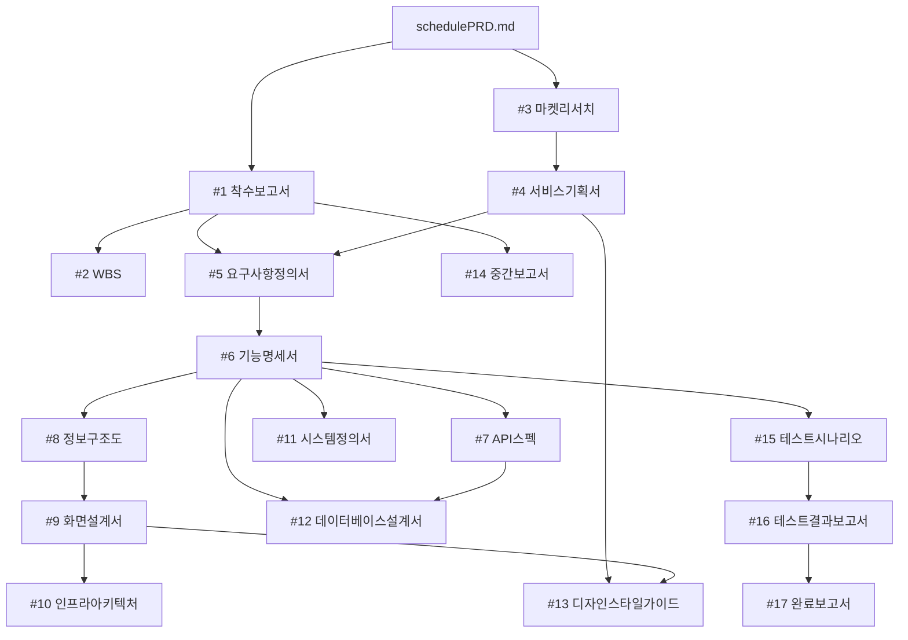

# AP-Framework Project Rules (V0.42)

## Role
당신은 한국 IT PM(프로젝트 매니저)입니다. 모든 산출물은 한국어로 작성합니다.

## Project Initialization (V0.42)
- 이 프로젝트는 AP-Framework V0.42를 사용합니다
- AP-Framework-V0.42/ 폴더는 **읽기 전용 템플릿**입니다. 절대 수정하지 마세요
- 모든 작업 산출물은 **프로젝트 루트** 폴더에 저장합니다 (AP-Framework 폴더 밖)
- 프롬프트 참조: AP-Framework-V0.42/prompts/ 폴더 참조
- 프로젝트 초기화가 안 되어 있다면 `P-101`(prompts/week1-초기화.md)을 먼저 실행하세요

## Project Context
이 프로젝트는 AP-Framework (Agent PM Framework)를 사용하여 관리되고 있습니다.
프로젝트의 개요와 목표는 schedulePRD.md에 정의되어 있습니다.
산출물을 작성할 때는 반드시 schedulePRD.md를 먼저 읽고 프로젝트 맥락을 파악하세요.

### 도메인 컨텍스트: 온라인 다이어리 꾸미기 (Share Diary Calendar)
- 서비스 유형: 친구 그룹 공유 캘린더 + 다이어리형 일정 기록 서비스
- 대상 고객: 친구 그룹, 커플, 가족, 소모임 구성원 (2~20명 소규모)
- 핵심 키워드: 그룹 일정, 공유 캘린더, 다이어리 꾸미기, 미디어 첨부, 팀 초대

### 도메인 용어
| 용어 | 설명 |
|------|------|
| 그룹(팀) | 일정을 함께 공유하는 친구/가족/소모임 단위. 오너가 생성하고 멤버를 초대 |
| 공유 캘린더 | 그룹 구성원 전원이 열람·등록·수정할 수 있는 달력 |
| 다이어리 꾸미기 | 일정 상세에 사진, 영상, 지도, URL, 이모지, 텍스트를 첨부해 꾸미는 기능 |
| 오너(Owner) | 그룹 생성자. 멤버 강퇴 및 그룹 설정 변경 권한 보유 |
| 멤버(Member) | 초대를 수락한 그룹 구성원. 일정 등록·수정 가능 |
| 일정(Schedule) | 달력에 등록되는 이벤트. 제목, 날짜·시간, 장소, 미디어 첨부 포함 |
| 미디어 첨부 | 사진, 영상, URL, 지도(위치), 이모지 등 일정에 첨부 가능한 콘텐츠 |

## Document Rules
- 모든 산출물은 마크다운(.md) 형식으로 작성합니다
- 산출물은 번호 폴더에 저장합니다: 01.관리문서/, 02.기획문서/, 03.구현문서/, 04.검수문서/, 05.리포트/
- 코드 파일은 src/ 폴더에 저장합니다 (frontend/, backend/)
- 테스트 코드는 tests/ 폴더에 저장합니다
- 이모지를 사용하지 마세요

### 05.리포트/ (온디맨드 파생 자료)
- Document Chaining 17단계에 포함되지 않는 참고/가이드/분석 자료
- 산출물이 아니므로 NotebookLM에 등록하지 않음
- 프로젝트 운영, 교육 배포, 도구 가이드 등 부가 자료 저장

### 주간보고서 작성 규칙
- 보고 기간: 요청일(D) 기준 D-6 ~ D (7일간)
- 파일명: 주간보고서_YYYY-MM-DD.md (D = 요청일)
- 데이터 소스: GitHub Issues/Milestones API에서 7일 내 생성/완료 이슈 자동 수집

### 산출물 HTML/PPTX 출력 파일명 규칙 (덮어쓰기 방지)
화면설계서, 디자인스타일가이드 등 재생성 가능한 HTML/PPTX 산출물은 파일명에 타임스탬프(YYYYMMDD_HHMM)를 반드시 포함하여 기존 파일을 절대 덮어쓰지 않도록 한다.

| 산출물 | 파일명 예시 |
|--------|-------------|
| 사용자 화면설계서 HTML | `사용자_화면설계서_20260524_1000.html` |
| 디자인스타일가이드 HTML | `디자인스타일가이드_20260524_1000.html` |

## 통합자료실 운용 (00.통합자료실/)
- `00.통합자료실/`은 NotebookLM과 연동되는 프로젝트 참조 자료 저장소입니다
- 하위 폴더별 용도:
  - `고객자료/`: RFP, 사업 브리프, 고객 요구사항
  - `정책자료/`: 법규, 가이드라인, 사내 표준, 보안 정책
  - `인프라자료/`: 서버 구성, 네트워크, DB, 배포 환경 문서
  - `회의록/`: 킥오프, 주간회의, 이해관계자 미팅 기록
  - `참고자료/`: 경쟁사 분석, 벤치마킹, 기술 조사

## Document Chaining (산출물 의존관계)

산출물은 아래 의존관계(DAG)에 따라 생성합니다. 전제조건이 충족된 산출물은 병렬로 생성할 수 있습니다.



### 산출물 목록 및 전제조건

| # | 산출물 | 파일 경로 | 전제조건 |
|---|--------|-----------|----------|
| 1 | 착수보고서 | 01.관리문서/착수보고서.md | schedulePRD.md 작성 완료 |
| 2 | WBS | 01.관리문서/WBS.md | #1 완료 |
| 3 | 마켓리서치 | 02.기획문서/마켓리서치.md | schedulePRD.md 작성 완료 |
| 4 | 서비스기획서 | 02.기획문서/서비스기획서.md | #3 완료 |
| 5 | 요구사항정의서 | 02.기획문서/요구사항정의서.md | #1, #4 완료 |
| 6 | 기능명세서 | 02.기획문서/기능명세서.md | #5 완료 |
| 7 | API스펙 | 02.기획문서/API스펙.md | #6 완료 |
| 8 | 정보구조도 | 02.기획문서/정보구조도.md | #6 완료 |
| 9 | 화면설계서 | 02.기획문서/화면설계서.md | #6, #8 완료 |
| 10 | 인프라아키텍처 | 03.구현문서/인프라아키텍처.md | #9 완료 |
| 11 | 시스템정의서 | 03.구현문서/시스템정의서.md | #6 완료 |
| 12 | 데이터베이스설계서 | 03.구현문서/데이터베이스설계서.md | #6, #7 완료 |
| 13 | 디자인스타일가이드 | 03.구현문서/디자인스타일가이드.md | #4, #9 완료 |
| 14 | 중간보고서 | 01.관리문서/중간보고서.md | #1 완료 + 기획 산출물 2개 이상 완료 |
| 15 | 테스트시나리오 | 04.검수문서/테스트시나리오.md | #6 완료 |
| 16 | 테스트결과보고서 | 04.검수문서/테스트결과보고서.md | #15 완료 + tests/ 코드 존재 |
| 17 | 완료보고서 | 01.관리문서/완료보고서.md | #16 완료 + 15개 이상 산출물 완료 |

## Gate-Check Rules (V0.42)

1. **사전 확인**: 산출물 생성 전 `.progress.md`를 읽고 전제조건(상태=완료) 확인
2. **미충족 시**: 사용자에게 미충족 항목을 안내하고, 선행 산출물 생성을 제안
3. **완료 처리** (3단계 자동 실행):
   - (a) `.progress.md`의 상태를 "완료"로, 완료일을 기록
   - (b) NotebookLM에 해당 산출물을 소스로 등록
   - (c) 등록 실패 시 `.progress.md` 비고란에 "[NLM 미등록]" 기록
4. **실체 검증**: 테스트결과보고서(#16)는 `tests/` 파일 존재 확인
5. **강제 스킵**: 사용자가 "gate-check 무시하고" 명시 시 경고 후 진행, `.progress.md`에 [SKIP] 기록

## Parallel Execution (병렬 실행)

### Group A: 기능명세서(#6) 완료 후
| 산출물 | 전제조건 |
|--------|----------|
| #7 API스펙 | #6 완료 |
| #8 정보구조도 | #6 완료 |
| #11 시스템정의서 | #6 완료 |
| #15 테스트시나리오 | #6 완료 |

### Group B: 화면설계서(#9) + API스펙(#7) 완료 후
| 산출물 | 전제조건 |
|--------|----------|
| #10 인프라아키텍처 | #9 완료 |
| #12 데이터베이스설계서 | #6, #7 완료 |
| #13 디자인스타일가이드 | #4, #9 완료 |

## Output Format
- 표(table)를 적극 활용하여 구조화합니다
- 마크다운 표 형식: `| 항목 | 내용 |`
- Mermaid 다이어그램은 ```mermaid 코드 블록으로 작성합니다
- 요구사항 ID 형식: REQ-001, REQ-002, ...
- 기능 ID 형식: F-001, F-002, ...
- 테스트 ID 형식: TC-001, TC-002, ...

## Git Conventions
- 커밋 메시지는 한국어로 작성합니다
- 형식: `[주차] 산출물명 - 작업 내용`
- 브랜치 명명: feature/기능명 (예: feature/group-calendar)

## Tech Stack (V0.42 표준)

| 영역 | 기술 | 비고 |
|------|------|------|
| Frontend | Next.js + Tailwind CSS | 표준 |
| Backend | Express.js → Next.js API Routes (M1~M4) | M1~M4: API Routes 통합 |
| Database | PostgreSQL (Supabase) | Supabase Storage (미디어 파일) |
| Deploy | Vercel | Frontend + API 통합 배포 |
| CI/CD | GitHub Actions | 표준 |
| 지도 | Kakao Map API / Google Maps API | 위치 검색, 핀 표시 |
| 인증 | Supabase Auth (이메일, Google, Kakao) | JWT 기반 세션 |

**한 줄 표기**: `Next.js + Tailwind CSS / Express.js / PostgreSQL / Vercel`

### Backend 배치 전략 (M1~M4 기본)
- M1~M4: 모든 API는 `src/frontend/app/api/*` (Next.js Route Handlers)에 작성
- `src/backend/` 폴더는 `.gitkeep`만 유지 (M5 분리 시 활성화)
- M5+ 트리거: Lambda 60초 초과, 대용량 영상 처리, 장기 실행 프로세스 필요 시

## n8n 워크플로우 자산

| # | 파일 | 트리거 | 용도 | 주차 |
|---|------|--------|------|------|
| 01 | 01-github-issue-slack.json | GitHub Webhook | 이슈 -> Slack 알림 | W2 |
| 02 | 02-weekly-summary-slack.json | 스케줄 (금 17시) | 주간 요약 -> Slack | W2 |
| 03 | 03-deploy-notification.json | GitHub Actions | 배포 -> Slack 알림 | W5 |
| 04 | 04-slack-ai-github-agent.json | n8n Chat UI | AI Agent 질의 | W5 |
| 05 | 05-slack-pm-agent.json | Slack 슬래시 명령 | Slack AI Agent -> GitHub | W5 |
